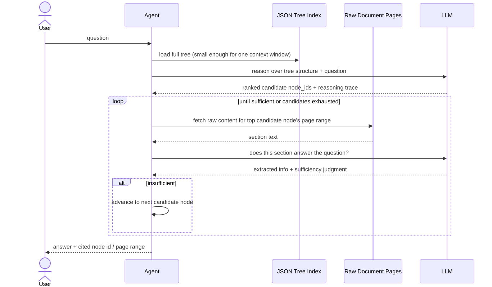

# PageIndex — Architecture and How It Works

> Part of the analysis indexed in [README.md](README.md). Sourced from the
> [GitHub README](https://github.com/VectifyAI/PageIndex), [docs.pageindex.ai](https://docs.pageindex.ai),
> the [pageindex-intro blog post](https://pageindex.ai/blog/pageindex-intro), and third-party
> technical write-ups ([buildfastwithai's guide](https://www.buildfastwithai.com/blogs/vectorless-rag-pageindex-guide)).
> Flagged explicitly below wherever the public material is genuinely thin — this project does not
> publish full internal algorithmic detail, and this document says so rather than inventing it.

## 1. Two phases: index once, reason many times

PageIndex splits cleanly into an **offline indexing phase** (run once per document) and an
**online retrieval phase** (run once per query). This mirrors the embed-once/search-many pattern
of vector RAG structurally, while replacing what happens inside each phase entirely.

## 2. Indexing phase — building the tree



Given a PDF or Markdown file:

1. **Structure detection.** The tool scans the first N pages (`--toc-check-pages`, default 20) for
   an existing table of contents. If a Markdown file is given, `#`-heading levels directly
   determine node hierarchy instead — a much cheaper path than PDF structure inference.
2. **Tree skeleton.** Whether from a parsed ToC or LLM-inferred structure, each section becomes a
   node with a `node_id`, `title`, and a page range (`start_index`/`end_index`).
3. **Per-node summarization.** An LLM generates a `summary` field for each node from that node's
   actual page content — this is what lets the retrieval-phase LLM "see" what's inside a section
   without reading the full text of every section up front.
4. **Recursive splitting.** If a node exceeds `--max-pages-per-node` (default 10) or
   `--max-tokens-per-node` (default 20,000), it's split into child sub-nodes and the summarization
   step recurses into them.
5. **Output.** A nested JSON tree. The README's own example node:

```json
{
  "title": "Financial Stability",
  "node_id": "0006",
  "start_index": 21,
  "end_index": 22,
  "summary": "The Federal Reserve...",
  "nodes": [...]
}
```

For a representative 50-page SEC filing, one third-party write-up reports this process yields
roughly **30–50 nodes** — small enough that the *entire tree* fits in a single LLM context window
at query time, which is precisely what makes the retrieval phase below possible without a vector
index.

**What's genuinely undocumented publicly:** the exact prompting/algorithm for structure inference
when no ToC exists at all (pure heading/layout inference from raw PDF text), and the precise
summarization prompt. The official blog post itself provides the target JSON shape but not the
generation mechanism — this is closed implementation detail inside the open-source code, not
something the docs walk through narratively. Reading the actual `pageindex/` source in the repo
would be the way to close this gap if it matters for a build decision.

## 3. Retrieval phase — reasoning-based tree search



The project's own blog post describes retrieval as an explicit iterative loop, quoted directly:

1. *"Read the Table of Contents (ToC). Understand the document's structure and identify sections
   that might be relevant."*
2. *"Select a Section. Choose the section most likely to contain useful information based on the
   question."*
3. *"Extract Relevant Information. Parse the selected section to gather any content"* that helps
   answer the question.
4. *"Is the Information Sufficient?"* — if not, loop back to step 1 with a different section.
5. *"Answer the Question"* once enough has been gathered.

Concretely, per a third-party technical deep-dive: the full tree transfers to an LLM in one call;
the model returns **ranked candidate node IDs with a reasoning trace**; the system fetches raw
page content for the top candidate(s) and passes it to the LLM to extract/judge sufficiency; if
insufficient, it advances to the next candidate rather than re-querying a similarity index.

**What's genuinely undocumented publicly:** the *decision mechanism* behind branch selection.
Neither the official blog nor third-party analyses specify whether this is single-pass ranking,
iterative refinement, or something closer to actual tree search with backtracking. One critical
technical review's blunt assessment is worth quoting directly here, because it cuts through the
"agentic tree search" framing: *"[PageIndex's retrieval is] closer to structured prompting than to
Monte Carlo Tree Search... It's GPT-4o following instructions, not sophisticated algorithmic
search."* Treat "agentic tree search" as a name for a prompting pattern over a small, LLM-legible
document map — not a claim about a novel search algorithm with formal guarantees.

## 4. Usage surface

**CLI (self-hosted):**
```bash
pip3 install --upgrade -r requirements.txt
python3 run_pageindex.py --pdf_path /path/to/document.pdf
# or:
python3 run_pageindex.py --md_path /path/to/document.md
```
Key flags: `--model` (default `gpt-4o-2024-11-20`), `--toc-check-pages`, `--max-pages-per-node`,
`--max-tokens-per-node`, `--if-add-node-id`, `--if-add-node-summary`, `--if-add-doc-description`.

**Agentic integration:** an example (`examples/agentic_vectorless_rag_demo.py`) wires PageIndex
into the OpenAI Agents SDK, treating tree navigation as an agent tool call rather than a
fixed pipeline step — consistent with the "retrieval as a tool" pattern covered in
[docs/technical_docs/06_evaluation_and_recent_advancements.md §10](../technical_docs/06_evaluation_and_recent_advancements.md).

**Cloud/hosted:** a chat product (chat.pageindex.ai), a developer API (pageindex.ai/developer),
and an MCP server, offering enhanced OCR and hosted tree building beyond what the open-source CLI
does with standard PDF parsing. Public pricing/rate-limit details were not found in the pages
checked — the developer portal points to a dashboard rather than publishing numbers on the
marketing site.

## 5. Ecosystem

Vectify AI positions PageIndex as the anchor of a small open-source ecosystem: **OpenKB** (LLM
knowledge base compilation), **ChatIndex** (tree indexing applied to conversation history),
**ConDB** (a KV-cache-native context database), and a dedicated **PageIndex MCP server**. Not
independently investigated in depth for this analysis — noted here for completeness since they
extend the same tree-and-reason pattern beyond static documents.
