# PageIndex — Strengths, Limitations, and Comparison to Vector/Graph RAG

> Part of the analysis indexed in [README.md](README.md). The critical assessment here leans
> heavily on one specifically balanced third-party source
> ([sjramblings.io's "Good, Bad, and Ugly" deep dive](https://sjramblings.io/pageindex-deep-dive-vectorless-rag/))
> alongside [buildfastwithai's technical guide](https://www.buildfastwithai.com/blogs/vectorless-rag-pageindex-guide),
> specifically because most other coverage found during research reads as uncritical amplification
> of Vectify AI's own marketing claims. Quoted passages are attributed inline.

## 1. The Good

- **Genuine paradigm difference, not a chunking tweak.** One review frames this well: PageIndex is
  *"not another 'improved chunking strategy' paper"* — it removes the similarity-search step
  entirely rather than optimizing it, which is a structurally different bet than most 2023–2025
  RAG advances covered in
  [docs/technical_docs/06_evaluation_and_recent_advancements.md](../technical_docs/06_evaluation_and_recent_advancements.md).
- **Strong results on the one benchmark that exists.** 98.7% on FinanceBench's full 10,231-question
  set (via Mafin 2.5) against a commonly cited ~30–50% for vector RAG baselines on the same
  benchmark is a large, real gap — not a marginal claimed improvement.
- **Built-in explainability.** *"Every answer traces back to specific page numbers and section
  paths. No opacity."* This directly satisfies the citation-grounding requirement this project's
  own architecture already treats as non-negotiable
  ([docs/technical_docs/07_recommended_architecture_for_shamela_rag.md §6](../technical_docs/07_recommended_architecture_for_shamela_rag.md#6-generation-and-grounding--a-domain-specific-requirement-not-a-nice-to-have)).
- **Cross-reference following.** Because retrieval understands document structure rather than
  chunk-level semantic similarity, it can follow "see Appendix C" style references that vector
  search has no native mechanism for at all.

## 2. The Bad

- **Full LLM dependency, both ends.** Unlike vector RAG, which pays an embedding cost once,
  *"PageIndex pays at both ends"* — indexing and every retrieval query both require LLM calls.
  Estimated cost: **$0.50–$5.00 per 100-page document** for indexing alone, with no offline mode
  and no local-model support out of the box (LiteLLM support exists for multi-provider API
  access, but there's no embedding-free/LLM-free path at all).
- **Single-benchmark validation.** *"The 98.7% FinanceBench number is impressive, but it is the
  only public benchmark."* No published results exist for technical documentation, academic
  papers, or — most relevant here — **non-English or classical-register content**. This is the
  same "don't trust a benchmark to transfer to your domain" caution already established in
  [docs/technical_docs/03_embeddings_and_vector_stores.md §9](../technical_docs/03_embeddings_and_vector_stores.md#9-practical-guidance-evaluate-dont-assume)
  and [09_open_source_arabic_llms.md §2](../technical_docs/09_open_source_arabic_llms.md#2-why-this-matters-general-arabic-llms-measurably-struggle-on-islamic-content-specifically) —
  it applies here with even less existing evidence than for embedding models or LLMs generally.
- **Structure-dependent by design.** Performance is reported to degrade on messy, unstructured
  documents — the entire method leans on there being a real hierarchy to navigate.

## 3. The Ugly

- **Data sovereignty.** Self-hosted PageIndex still sends *"every page of every document through
  OpenAI's API"* (or whichever LLM provider is configured) for both indexing and retrieval. One
  reviewer calls this *"likely disqualifying without a Business Associate Agreement"* for
  HIPAA/SOC 2 environments — explicitly a compliance issue, not vendor lock-in.
- **No multi-document search mechanism.** Vector databases scale to billions of documents across
  a corpus; PageIndex, as documented, has no built-in way to select among many document trees —
  it operates *within* a document once you've already decided which one to look in.
- **Latency.** *"Vector searches return results in milliseconds. PageIndex's multi-step reasoning
  chain... takes seconds"* — a real problem for interactive, sub-second use cases.
- **"Reasoning" is oversold in the marketing framing.** Per §3 above (doc 01), this is closer to
  structured LLM prompting over a small legible tree than to a genuine search algorithm with
  formal guarantees — worth internalizing before treating "agentic tree search" as more
  sophisticated than it is.

## 4. Structural comparison: Vector RAG vs. PageIndex

| Dimension | Vector RAG | PageIndex |
|---|---|---|
| Indexing cost | Embed once (cheap, no LLM required) | LLM calls per document — structure inference + per-node summarization |
| Query cost | One embedding + ANN search (cheap, fast) | Multiple sequential LLM calls per query |
| Query latency | Milliseconds | Seconds (multi-step reasoning chain) |
| Scale ceiling | Billions of chunks (per doc 03's vector DB comparison) | No documented multi-document search; operates within one document |
| Explainability | Chunk + similarity score (weak causal story) | Node id + page range + reasoning trace (strong causal story) |
| Cross-reference handling | None natively | Native, since structure is preserved |
| Best-known validation | Broad (MTEB, many production deployments) | One benchmark (FinanceBench), one domain (financial) |
| Data sovereignty | Self-hostable end-to-end with open embedding models | Every page passes through an LLM API by default — a real compliance question |

## 5. Where this sits relative to this project's GraphRAG framing

[docs/technical_docs/05_knowledge_graphs_and_graphrag.md](../technical_docs/05_knowledge_graphs_and_graphrag.md)
draws the line between vector similarity (flat, unlabeled "aboutness") and a knowledge graph
(explicit, typed, traversable relationships). PageIndex is neither, exactly — it's closer to a
**third category**: a single-document hierarchical index navigated by LLM reasoning rather than
graph traversal or vector similarity. It shares the graph side's core advantage (structure is
explicit and traversable, not flattened into "similarity") but at a much smaller scope — one
document's internal table of contents, not a cross-document relationship graph like this
project's narrator/isnad/hadith-concordance tables. It's also, functionally, an LLM-automated
version of what [docs/technical_docs/02_chunking_strategies.md §4](../technical_docs/02_chunking_strategies.md#4-document-structure-aware--hierarchical-chunking)
already calls **hierarchical/TOC-anchored chunking**, with the retrieval mechanism (LLM reasoning
over the tree) folded in as part of the same method rather than left as a separate downstream
decision. That overlap — and where it does and doesn't already exist for this specific corpus —
is the subject of [03_fit_assessment.md](03_fit_assessment.md).
