# PageIndex — Fit Assessment

> Part of the analysis indexed in [README.md](README.md). Two questions: does this fit the
> Shamela RAG project (§1–3), and where else would it plausibly fit (§4)? Grounded in the
> architecture already committed to in `docs/technical_docs/` and the cost/limitation facts from
> [02_strengths_limitations_and_comparison.md](02_strengths_limitations_and_comparison.md) — not
> a generic "this tool is great, use it everywhere" recommendation.

## 1. The non-obvious point of leverage: this corpus already has the expensive part

PageIndex's indexing phase (per
[01_architecture_and_how_it_works.md §2](01_architecture_and_how_it_works.md#2-indexing-phase--building-the-tree))
spends most of its LLM budget on **structure detection** — inferring a hierarchical table of
contents from a raw document that may not have one. This project's corpus doesn't have that
problem: **every one of the 8,589 books already has a curated, hierarchical `toc.jsonl`**, built
from the original Shamela metadata, not inferred by an LLM guessing at heading levels in raw text.

That means adopting PageIndex's *retrieval* pattern here would skip its most expensive and
error-prone step entirely. The adapted flow:

Concretely: map `toc.jsonl`'s existing `parent_id` hierarchy directly into a PageIndex-style node
schema (`node_id`, `title_text`, page range from consecutive TOC entries — this is exactly the
TOC-anchored chunking boundary logic already specified in
[docs/technical_docs/10_ingestion_and_indexing_pipeline.md §3 Stage 3](../technical_docs/10_ingestion_and_indexing_pipeline.md#3-pipeline-stages)).
The only PageIndex-original work left is **per-node summarization** — one LLM call per TOC
section, not per-document structure inference.

## 2. Where this would and wouldn't help across the four use cases

Not all four use cases from
[docs/technical_docs/07_recommended_architecture_for_shamela_rag.md §5](../technical_docs/07_recommended_architecture_for_shamela_rag.md#5-query-routed-retrieval-one-path-per-use-case)
benefit equally — for two of them, this project already has something strictly better than what
PageIndex offers.

- **Hadith takhrij and tafsir-by-verse: skip this.** These already have exact, pre-curated
  structured lookups (`hadith_xrefs`, `tafsir_xrefs`, `page_isnads` — per
  [docs/technical_docs/05_knowledge_graphs_and_graphrag.md](../technical_docs/05_knowledge_graphs_and_graphrag.md)).
  A join against a curated cross-reference table is exact and free; LLM reasoning over a tree to
  *rediscover* what a lookup table already states outright would be strictly worse on both cost
  and precision. Applying PageIndex here would be solving an already-solved problem with a more
  expensive tool.
- **General Q&A and fiqh lookup: plausible fit, worth piloting.** These currently rely on flat
  hybrid dense+lexical retrieval over TOC-anchored chunks (per doc 07 §5). Once vector/lexical
  search has narrowed a query down to one specific book, reasoning over *that book's* actual TOC
  tree to find the precise masala or passage — rather than trusting whichever fixed-size chunk
  happened to embed closest to the query — could plausibly improve precision on long, structurally
  rich books (a multi-hundred-page fiqh commentary, for instance), and comes with a stronger
  citation trail (node + page + reasoning trace) than a bare top-k chunk list.

## 3. The cost reality, sized against this corpus specifically

Per [02_strengths_limitations_and_comparison.md §2](02_strengths_limitations_and_comparison.md#2-the-bad),
vanilla PageIndex indexing runs roughly **$0.50–$5.00 per 100-page document**. Applied naively to
the full corpus (7.6M pages, per
[docs/technical_docs/project structure](../technical_docs/shamela4_dataset_card.md)):
**76,000 hundred-page units × $0.50–$5.00 ≈ $38,000–$380,000** to tree-index everything up front.
That is not a casually affordable number for this project, and it's before accounting for
retrieval-time LLM calls on top.

Two things bring this down, though neither should be assumed without measuring:

- **Skipping structure inference** (§1) removes what's generally the more expensive, harder part
  of indexing (inferring hierarchy from unstructured layout) — likely a meaningful fraction of
  that per-document cost, but no public breakdown separates "structure inference cost" from
  "summarization cost" precisely enough to state a discounted number honestly. This needs a small
  pilot measurement, the same "evaluate, don't assume" discipline already established in
  [docs/technical_docs/03_embeddings_and_vector_stores.md §9](../technical_docs/03_embeddings_and_vector_stores.md#9-practical-guidance-evaluate-dont-assume).
- **Lazy, on-demand, cached tree-building is the real fix.** Nothing requires indexing all 8,589
  books up front. Since vector/lexical search already narrows a query to a small candidate set of
  books before any PageIndex-style navigation would apply (§2 above), build a book's tree **the
  first time a query actually lands on it**, cache the result, and never rebuild it. Under
  doc 07 §8 ADR-005's phased rollout (19 curated books → rest of categories 06/03 → everything
  else), most books may never need a tree at all if queries concentrate on a smaller working set —
  which, empirically, is likely, given how skewed real usage tends to be toward well-known texts.

This lazy pattern is also the direct answer to the "no multi-document search mechanism" limitation
from doc 02 §2/§3: don't ask PageIndex to search across documents at all — let the existing
vector/lexical layer do what it's already good at (searching across millions of chunks), and
reserve tree-reasoning for precision navigation *within* whichever single book that search already
identified.

## 4. Where this fits outside this project

The user's original question named finance explicitly — worth answering broadly, not just for
this corpus.

| Domain | Fit | Why |
|---|---|---|
| **Financial reports / regulatory filings** | **Strong — proven** | This is PageIndex's flagship validated case (FinanceBench/Mafin 2.5, 98.7%). Long, hierarchically structured, cross-reference-heavy documents (10-Ks, annual reports) are exactly the shape this method targets. |
| **Legal (contracts, case law, statutes)** | **Plausible, unproven** | Similar structural shape to financial filings — numbered clauses, cross-references, hierarchical sections — but no published benchmark exists for this domain specifically (per doc 02 §2's "single-benchmark validation" limitation). Worth piloting, not assuming. |
| **Technical/engineering documentation** | **Plausible, unproven** | Manuals and specs are long and hierarchically headed, similar reasoning applies; again untested publicly. |
| **Academic papers / research corpora** | **Weak** | Papers are usually short enough that ordinary chunking already works well; the structural-navigation advantage matters most for *long* documents, which most individual papers aren't. |
| **Medical/clinical records** | **Blocked by default** | Per doc 02 §3's data-sovereignty finding, sending patient data through a third-party LLM API by default is a real compliance problem (HIPAA) unless fully self-hosted with a private/on-prem LLM — achievable, but a materially bigger lift than the default deployment. |
| **Customer support / short unstructured content** | **Poor fit** | The critique's own recommendation: avoid for short, unstructured, high-volume, low-latency content — ordinary vector RAG or even keyword search is more appropriate and far cheaper. |
| **Massive multi-document corpora without a pre-narrowing step** | **Poor fit as a sole solution** | No native multi-document search (doc 02 §3) — needs pairing with something that scales across documents first, exactly as recommended for this project's own use in §3 above. |

## 5. Bottom line

PageIndex is a legitimate, well-validated (if narrowly validated) approach for **long, structurally
rich, citation-critical documents** — and this corpus is exactly that, more so than most target
domains, since its structure is *already curated* rather than inferred. The realistic
recommendation is not "adopt PageIndex," but **adopt its retrieval pattern (reasoning over an
existing hierarchy) for the two use cases that lack better structured ground truth (general Q&A,
fiqh lookup), applied lazily and on-demand per book, never as a blanket full-corpus indexing
job** — and to leave the two use cases that already have exact curated cross-references
(hadith takhrij, tafsir-by-verse) exactly as designed in doc 07, since nothing here improves on
an exact join.
