# How Embeddings Work

> Part of the series indexed in [00_overview.md](00_overview.md). This is the mechanical
> explanation doc 03 assumes: what actually happens between "text goes in" and "vector comes out,"
> how that vector gets trained to be useful for retrieval, and how the three retrieval
> architectures introduced in
> [docs/technical_docs/03_embeddings_and_vector_stores.md §4](../technical_docs/03_embeddings_and_vector_stores.md#4-multi-vector--late-interaction-models)
> differ structurally.

## 1. Producing a single embedding: the bi-encoder pipeline

Every dense embedding model in production today (BGE-M3, multilingual-e5, OpenAI's
text-embedding-3, etc.) follows the same basic pipeline for turning text into a vector:

1. **Tokenization.** Text is split into subword pieces (not whole words — this is exactly why
   Arabic morphology matters for retrieval, per
   [docs/technical_docs/03_embeddings_and_vector_stores.md §5](../technical_docs/03_embeddings_and_vector_stores.md#5-sparse-and-hybrid-representations):
   a single Arabic word can tokenize very differently depending on its attached prefixes/suffixes,
   which is part of why root-normalization helps lexical search even when the dense embedder
   handles it reasonably at the subword level).
2. **Transformer encoding.** The token sequence passes through stacked self-attention + feed-
   forward layers, producing one **contextualized** vector per token — contextualized meaning the
   vector for "بنك" (bank) differs depending on whether the surrounding sentence is about a river
   or a financial institution.
3. **Pooling.** A whole passage needs one vector, not one per token, so the per-token vectors are
   collapsed into a single vector — commonly by **mean pooling** (averaging all token vectors),
   **CLS pooling** (using a special first-token vector the model was trained to summarize the
   whole sequence into), or **last-token pooling** (common for embedding models built from
   decoder-style LLMs, which process text left-to-right).
4. **L2 normalization.** The pooled vector is rescaled to unit length. This step matters more than
   it looks — it's what makes cosine similarity and plain dot product the same operation, covered
   precisely in [02_similarity_metrics_and_geometry.md](02_similarity_metrics_and_geometry.md).

The result is a single dense vector (1024 dimensions is a common size for models like
multilingual-e5-large and BGE-M3) that's meant to place semantically similar texts near each other
in that 1024-dimensional space.

## 2. Training an embedding model: contrastive learning

A freshly pretrained language model doesn't produce good retrieval embeddings out of the box —
its representations are trained for predicting masked/next tokens, not for "is this passage
relevant to this query." Retrieval-quality embeddings come from an additional **contrastive
training** stage:

- Each training example is a **triplet** (or a batch of triplets): an **anchor** (a query), a
  **positive** (a passage known to answer it), and one or more **negatives** (passages that don't
  answer it — either just other passages in the same training batch, "in-batch negatives," or
  deliberately **mined hard negatives**: passages that are lexically or superficially similar to
  the positive but actually wrong, which forces the model to learn finer distinctions than "shares
  some words").
- All of them pass through the **same** encoder (shared weights — a bi-encoder gets its name from
  encoding query and passage independently through one shared model, not two different ones).
- A **contrastive loss** (commonly InfoNCE) then pulls the anchor's vector toward the positive's
  vector and pushes it away from the negatives', for every example in the batch simultaneously.
- Repeated over millions of query-passage pairs, this is what actually shapes the embedding space
  into one where "relevant" correlates with "nearby" — nothing about the pretraining objective
  guarantees that on its own.

This is also why the "instruction prefix" pattern in models like multilingual-e5 exists (queries
get prefixed with `"query: "`, passages with `"passage: "` before encoding) — the model was
trained with that distinction present, so dropping it at inference time silently degrades results;
it's not a stylistic choice, it's part of the trained behavior.

## 3. Three architectures, three cost/precision tradeoffs

The three approaches referenced across `docs/technical_docs/03` and `04` differ in exactly **where
the query and document interact**:

- **Bi-encoder** (the default for first-stage retrieval): query and document are encoded
  *independently* into one vector each, and similarity is a single dot product. This is what
  makes bi-encoders fast at scale — every document's vector can be precomputed and stored, and a
  query only needs one new encoding at search time, per
  [docs/technical_docs/03_embeddings_and_vector_stores.md §6](../technical_docs/03_embeddings_and_vector_stores.md#6-vector-database-and-index-landscape).
  The cost is that all of a document's nuance gets compressed into one fixed-size vector before
  the query is ever seen — some information is necessarily lost.
- **Cross-encoder** (used for reranking, per
  [docs/technical_docs/04_retrieval_and_query_strategies.md §3](../technical_docs/04_retrieval_and_query_strategies.md#3-post-retrieval-optimization)):
  query and document are concatenated and encoded *together*, so every query token can attend to
  every document token directly. This is far more accurate but can't be precomputed — the
  document's representation depends on which query it's being scored against, so it only works as
  a second-stage reranker over a small candidate set (doc 04's "retrieve top-50, rerank to top-5"),
  never as the first-stage search over millions of documents.
- **Late interaction / multi-vector (ColBERT)**: a middle path. Query and document are each
  encoded independently (like a bi-encoder — document vectors are precomputable) but *into
  multiple vectors*, one per token, instead of one pooled vector. At scoring time, a **MaxSim**
  operation finds each query token's best-matching document token and sums those best-matches —
  keeping the precomputability of a bi-encoder while preserving much more of the fine-grained
  token-level signal a cross-encoder gets from joint attention. The tradeoff, per
  [docs/technical_docs/03_embeddings_and_vector_stores.md §4](../technical_docs/03_embeddings_and_vector_stores.md#4-multi-vector--late-interaction-models),
  is storage and compute cost: many vectors per document instead of one.

## 4. Why this matters for chunk-level design decisions already made

[docs/technical_docs/13_architecture_decisions.md ADR-004](../technical_docs/13_architecture_decisions.md#adr-004-chunk-sizing--512–1024-token-target-for-prose-genres-natural-unit-sizing-elsewhere)
set a 512–1024 token chunk-size target partly on faith in general chunking literature. The
mechanics above explain *why* that range specifically: pooling (§1 step 3) compresses an entire
chunk into one fixed-size vector regardless of chunk length, so a chunk that's too long dilutes a
single topic's signal across many unrelated sentences before pooling ever happens — the vector
ends up as a blurry average rather than a sharp representation of any one thing in the chunk. A
chunk that's too short does the opposite: not enough context for the contextualized token vectors
(§1 step 2) to disambiguate meaning before pooling collapses them. The 512–1024 range is where
most embedding models' own training data distribution sits, which is precisely why it works
reasonably as a default rather than being an arbitrary number.
