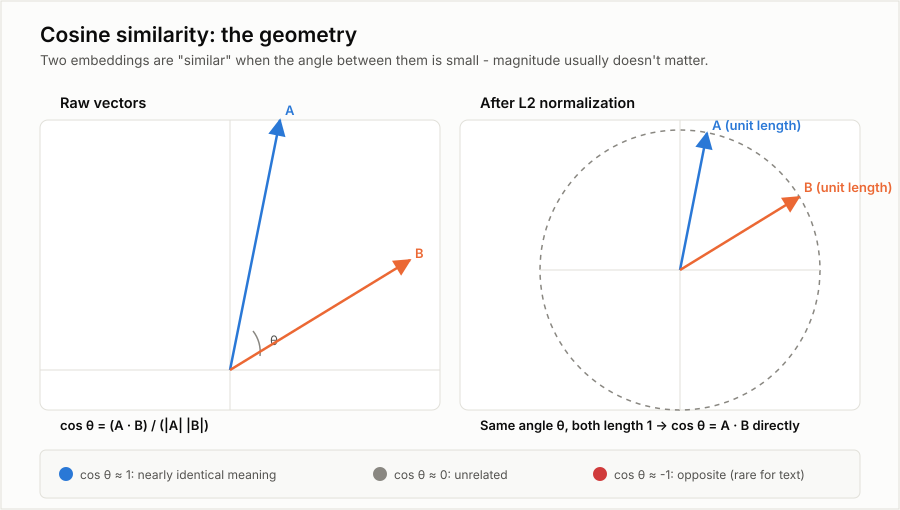

# Similarity Metrics and Geometry

> Part of the series indexed in [00_overview.md](00_overview.md). Every retrieval system in
> `docs/technical_docs/` ultimately reduces to "which stored vector is closest to this query
> vector" — this doc makes precise what "closest" actually means, since the three common answers
> (cosine similarity, dot product, Euclidean distance) are not interchangeable in general, only
> under a specific condition that's worth understanding rather than assuming.

## 1. Cosine similarity, geometrically



Two embeddings are vectors in a high-dimensional space (hundreds to low-thousands of dimensions in
practice, drawn as 2D above for legibility). **Cosine similarity** measures the angle between
them, ignoring their lengths entirely:

```
cos θ = (A · B) / (|A| |B|)
```

where `A · B` is the dot product (sum of elementwise products) and `|A|`, `|B|` are the vectors'
lengths (Euclidean norms). The result ranges from **1** (pointing the same direction — "maximally
similar" in whatever sense the model learned) through **0** (perpendicular — unrelated) to **-1**
(opposite direction — rare in practice for text embeddings, since most embedding spaces don't
actually use the full range symmetrically).

## 2. Why normalization makes dot product and cosine similarity the same thing

The right panel of the figure above is the important one. **L2 normalization** (§1 of
[01_how_embeddings_work.md](01_how_embeddings_work.md)) rescales every vector to length 1 —
geometrically, this projects every embedding onto the surface of a unit hypersphere. Once `|A|`
and `|B|` both equal 1, the cosine similarity formula's denominator is just `1 × 1 = 1`, so:

```
cos θ = A · B          (when both vectors are already unit-length)
```

This is why vector databases frequently just offer "dot product" as a distance metric and call it
equivalent to cosine similarity — **it only is** if every vector was normalized before storage.
Skipping normalization and using raw dot product would let a longer (higher-magnitude) vector
score as "more similar" purely from its length, not its direction — a real, easy-to-introduce bug
in a hand-rolled pipeline, not just a theoretical caveat.

## 3. A worked numeric example, by hand

Take two small 3-dimensional vectors (real embedding vectors have hundreds of dimensions, but the
arithmetic is identical, just longer):

```
A = [3, 4, 0]
B = [3, 0, 4]
```

**Dot product:** `A · B = (3×3) + (4×0) + (0×4) = 9`

**Lengths:** `|A| = sqrt(3² + 4² + 0²) = 5`, `|B| = sqrt(3² + 0² + 4²) = 5`

**Cosine similarity:** `cos θ = 9 / (5 × 5) = 0.36`

Normalize both first: `A_norm = [0.6, 0.8, 0], B_norm = [0.6, 0, 0.8]`. Their dot product:
`(0.6×0.6) + (0.8×0) + (0×0.8) = 0.36` — identical, confirming §2: once normalized, dot product
*is* cosine similarity, no division needed at query time. This is a real practical optimization,
not just a mathematical curiosity: normalizing once at indexing time means every query-time
comparison is a cheaper plain dot product instead of a cosine calculation repeated per candidate.

## 4. Euclidean distance — related, but not the same ranking in general

**Euclidean distance** measures straight-line distance between the two points, not the angle
between them as vectors from the origin: `|A - B| = sqrt(Σ(Aᵢ - Bᵢ)²)`. For the example above:
`A - B = [0, 4, -4]`, so `|A - B| = sqrt(0² + 4² + (-4)²) = sqrt(32) ≈ 5.66`.

**The two metrics agree in ranking once vectors are normalized to the same length** — for
unit-length vectors, smaller Euclidean distance always corresponds to higher cosine similarity
(they're related by a fixed monotonic formula: `|A-B|² = 2 - 2cos θ` when both are unit vectors).
This is why it usually doesn't matter in practice which one a given vector database defaults to
*as long as vectors are normalized* — but the two metrics can disagree if vectors aren't
normalized, since Euclidean distance is sensitive to magnitude in a way cosine similarity is
defined not to be. Know which one a chosen vector store actually uses by default (per
[docs/technical_docs/03_embeddings_and_vector_stores.md §6](../technical_docs/03_embeddings_and_vector_stores.md#6-vector-database-and-index-landscape))
rather than assuming.

## 5. What this means for ADR-001's pgvector choice

[docs/technical_docs/13_architecture_decisions.md ADR-001](../technical_docs/13_architecture_decisions.md#adr-001-graph-store--postgresql-with-recursive-ctes-not-a-dedicated-graph-database)
committed to `pgvector` for the vector store. `pgvector` supports cosine distance (`<=>`), L2/
Euclidean distance (`<->`), and inner product (`<#>`) as distinct operators — per §2 and §4 above,
whichever is chosen, embeddings must be **stored normalized** for cosine and inner-product to
agree and for the (cheaper) inner-product operator to be usable as a drop-in for cosine similarity
without re-normalizing at query time. This is a concrete implementation detail this ADR left
implicit — worth stating explicitly here so it isn't rediscovered as a bug later: normalize once
at ingestion, use `<#>` (inner product) at query time, and skip repeated cosine computation
entirely.
