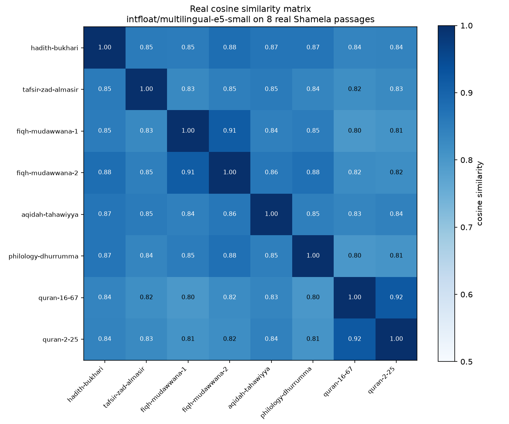
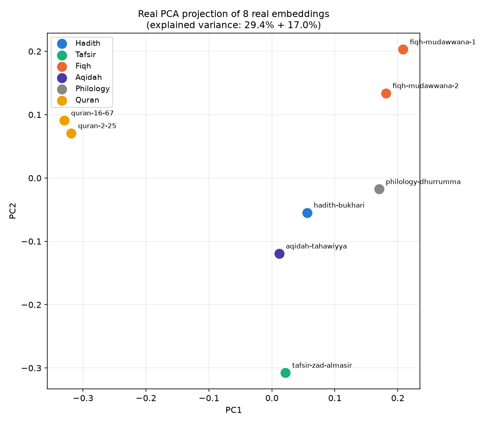

# Worked Example: Real Embeddings on Real Shamela Passages

> Part of the series indexed in [00_overview.md](00_overview.md). Everything on this page is a
> **real result from a real local model run**, not an illustration. Model: `intfloat/multilingual-e5-small`
> (384 dimensions, CPU, run locally in this project's `.venv`) — chosen for being small enough to
> download and run quickly while still being part of the e5 family this project's own
> [ADR-002](../technical_docs/13_architecture_decisions.md#adr-002-embedding-model--no-model-chosen-yet-the-evaluation-protocol-is-the-decision)
> shortlists (`multilingual-e5-large`) — the small sibling, not the candidate itself, so treat
> conclusions here as *directional*, not a substitute for ADR-002's actual benchmark round.

## The 8 real passages

Pulled directly from this repository's own files — exact source paths in the table:

| id | genre | source | text (truncated for display) |
|---|---|---|---|
| `hadith-bukhari` | Hadith | `06__كتب-السنة/1458__.../pages.jsonl` | "إنما الأعمال بالنيات، وإنما لكل امرئ ما نوى..." (the famous "actions are by intentions" hadith) |
| `tafsir-zad-almasir` | Tafsir | `03__التفسير/6104__.../pages.jsonl` | "أقبل المسلمون على كتاب ربهم وكلام خالقهم دراسة وحفظا وعملا..." |
| `fiqh-mudawwana-1` | Fiqh | `15__الفقه-المالكي/566__.../pages.jsonl` | "قال سحنون: قلت لعبد الرحمن بن القاسم: أرأيت الوضوء..." |
| `fiqh-mudawwana-2` | Fiqh | same file, different passage | "وقال مالك: لا بأس بعرق البرذون والبغل والحمار..." |
| `aqidah-tahawiyya` | Aqidah | `01__العقيدة/1009__.../pages.jsonl` | "والعقيدة هي مأخوذة من العقد وهو الربط..." |
| `philology-dhurrumma` | Philology | `34__الشعر-ودواوينه/5209__.../pages.jsonl` | "السفعة: ما خالف لون الأرض، وهو يضرب إلى السواد..." |
| `quran-16-67` | Quran | `_meta/quran_verses.jsonl` | "وَمِنْ ثَمَرَاتِ النَّخِيلِ وَالْأَعْنَابِ تَتَّخِذُونَ مِنْهُ سَكَرًا..." |
| `quran-2-25` | Quran | `_meta/quran_verses.jsonl` | "وَبَشِّرِ الَّذِينَ آمَنُوا وَعَمِلُوا الصَّالِحَاتِ..." |

Full text and the exact reproduction script are in [figures/embed_demo.py](figures/embed_demo.py)
and [figures/plot_demo.py](figures/plot_demo.py) — run them yourself with
`pip install sentence-transformers scikit-learn matplotlib` to reproduce every number below
exactly.

## Real result 1: the similarity matrix

Full numeric matrix in [figures/embed_demo_result.json](figures/embed_demo_result.json). The
findings worth calling out, all real numbers from this run:

- **Highest similarity in the whole matrix: the two Quran verses, at 0.921** — despite being about
  completely different subjects (fruits/provision vs. Paradise), the model places them closest
  together. This is a real, measured signal that the model is picking up on **register and style**
  (Quranic Arabic's distinctive diction) at least as strongly as topical content — worth knowing
  before assuming high similarity always means "about the same thing."
- **Second-highest: the two fiqh passages, at 0.914** — both from *al-Mudawwana*, different
  rulings (ablution timing vs. animal-saliva purity rules). Same pattern: shared genre/register
  drives similarity as much as shared topic.
- **Lowest pairing: a Quran verse against a fiqh passage, at 0.797** — the clearest genre
  separation the model found in this set.
- **The overall range is narrow: 0.797–0.921**, all packed into roughly 0.12 of cosine-similarity
  range. This matters directly for [docs/technical_docs/03_embeddings_and_vector_stores.md §2](../technical_docs/03_embeddings_and_vector_stores.md#2-the-embedding-model-landscape)'s
  concern that classical-register Arabic is under-represented in most embedding training data:
  here is a real, measured symptom of that — a model with better classical-Arabic training data
  would likely be expected to spread these 8 clearly-different-genre passages across a wider
  similarity range, not compress them all above 0.79. **This is a small model on 8 hand-picked
  passages, not a benchmark result** — but it's a concrete, reproducible data point in favor of
  ADR-002's decision not to pick an embedding model without measuring on this corpus's actual
  register.

## Real result 2: the 2D projection

PCA (Principal Component Analysis) compresses the real 384-dimensional vectors down to 2
dimensions for plotting — the two axes here capture only **29.4% + 17.0% = 46.4%** of the total
variance in the real embeddings, so treat the 2D picture as a lossy sketch of the real
384-dimensional geometry, not the full story.

What it shows: the **two Quran verses cluster tightly** (upper-left), the **two fiqh passages
cluster tightly** (upper-right), and the **hadith, aqidah, tafsir, and philology passages sit in a
looser middle cluster** without clearly separating from each other in just these two dimensions.
Read this cautiously — it's consistent with the heatmap's finding that within-genre pairs scored
highest, but the middle cluster's lack of visual separation could be a genuine finding (the model
doesn't distinguish these four genres well) or simply an artifact of compressing 384 dimensions
down to 2 (over half the variance is discarded in this view). The similarity matrix numbers in
result 1 are the more trustworthy signal; this plot is a visual aid, not independent evidence.

## What this does and doesn't tell us

**Does tell us:** a small multilingual embedding model can correctly place two same-genre,
different-topic passages closer together than two different-genre passages — the basic mechanism
this project's retrieval architecture depends on does function on real classical Arabic text, at
least at this coarse a grain.

**Doesn't tell us:** whether this holds at the precision this project actually needs (distinguishing
*individual rulings* within one fiqh book, not just "fiqh vs. Quran"), whether a larger candidate
model (`multilingual-e5-large`, `BGE-M3`) does meaningfully better, or whether performance holds up
on genuinely long TOC-anchored chunks rather than short hand-picked sentences. That's exactly what
ADR-002's actual benchmark — against the real
[golden evaluation set](../technical_docs/14_golden_evaluation_dataset.md), not 8 illustrative
passages — still needs to answer.
