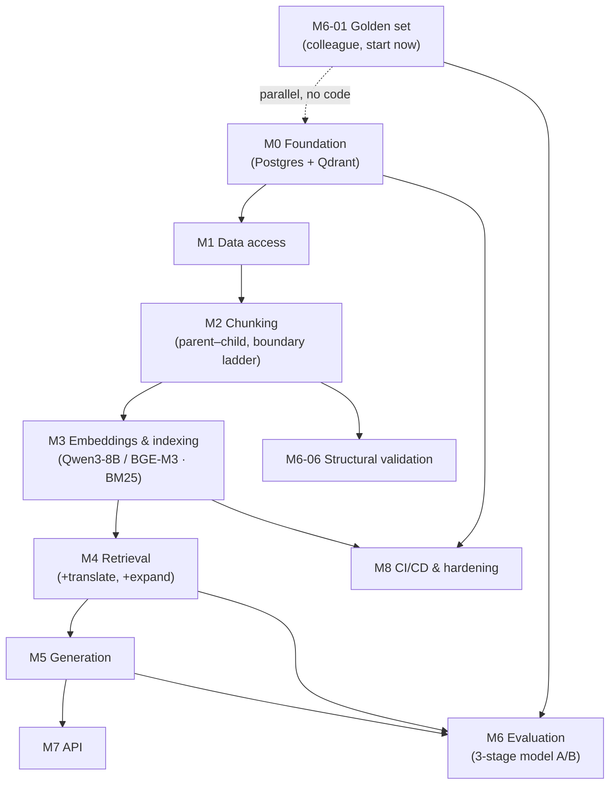

# General Module — Issue Backlog

> Companion to [general_module_plan.md](general_module_plan.md). **Aligned with the confirmed
> chunking mechanism** in
> [../../review_general_module_chunking_embeddings_brief.md](../../review_general_module_chunking_embeddings_brief.md)
> and the team's stack requests (**Qdrant**, **Qwen3-Embedding-8B**). Every issue is scoped to one
> PR. Labels, dependencies, size (S ≤ half-day · M ≈ 1–2 days · L ≈ 3+ days), and a suggested branch
> name are given. A `gh` bulk-create script is in the appendix.
>
> **Nothing here is implemented yet — this is the proposed backlog, awaiting approval.**

**Legend — labels:** `infra` `data` `chunking` `embeddings` `retrieval` `generation` `eval`
`api` `ci` `docs` `test` `good-first-issue`

Fixture book for all early work: **`1021__أسد-الغابة`** (category 26) — rich inline `toc-N` markup,
clear biographical entries, and a `شرح حديث عمار` style no-TOC book for the fallback path.

---

## M0 — Project foundation & infra

### M0-01 · Repo scaffolding & Python packaging
- **Labels:** infra · **Size:** S · **Depends on:** — · **Branch:** `feature/m0-scaffolding`
- Create `src/shamela_rag/` package layout, `pyproject.toml` (deps, entry points), code `README`,
  `tests/` root. Pin Python version.
- **Done when:** `pip install -e .` works in the existing `.venv`; empty `pytest` run passes.

### M0-02 · Config & secrets management
- **Labels:** infra · **Size:** S · **Depends on:** M0-01 · **Branch:** `feature/m0-config`
- `pydantic-settings` config: Postgres URL, **Qdrant URL/collection**, model names
  (`Qwen/Qwen3-Embedding-8B`, `BAAI/bge-m3`), corpus root, chunk-size params. Ship `.env.example`;
  keep `.env` git-ignored.
- **Done when:** config loads + validates; one unit test.

### M0-03 · Linting, formatting, type-checking, pre-commit
- **Labels:** infra · ci · **Size:** S · **Depends on:** M0-01 · **Branch:** `feature/m0-lint`
- `ruff` (lint+format) + `mypy` + `.pre-commit-config.yaml`.
- **Done when:** `ruff check`, `ruff format --check`, `mypy src` pass on the skeleton.

### M0-04 · Structured logging
- **Labels:** infra · **Size:** S · **Depends on:** M0-01 · **Branch:** `feature/m0-logging`
- Central logging config (levels via env, JSON-or-plain toggle).
- **Done when:** modules log through one configured logger; smoke test.

### M0-05 · Postgres + Qdrant via docker-compose
- **Labels:** infra · **Size:** M · **Depends on:** — · **Branch:** `feature/m0-compose`
- `docker-compose.yml` with **Postgres** (relational/provenance store) and **Qdrant** (vector
  store). Init: enable `pg_trgm`; create the Qdrant collection lazily from config.
- **Done when:** `docker compose up` gives a reachable Postgres and a reachable Qdrant (`/healthz`).

### M0-06 · Migration framework + base schema
- **Labels:** infra · data · **Size:** M · **Depends on:** M0-02, M0-05 · **Branch:** `feature/m0-migrations`
- Alembic; first migration creates `books`, `sections`, and `chunks` skeleton tables (columns
  fleshed out later). `chunks.source_text` is verbatim; a separate `retrieval_text` is normalized.
- **Done when:** `alembic upgrade head` runs clean.

### M0-07 · CI pipeline (lint + test on PR)
- **Labels:** ci · **Size:** M · **Depends on:** M0-03 · **Branch:** `feature/m0-ci`
- GitHub Actions on PR to `develop`/`stable-testing`/`main`: ruff, mypy, pytest with **Postgres +
  Qdrant service containers**. Emits `lint` and `test` checks used by branch protection.
- **Done when:** CI green on a trivial PR; check names match the plan §6.2.

---

## M1 — Data access

### M1-01 · Corpus file loaders
- **Labels:** data · **Size:** M · **Depends on:** M0-01 · **Branch:** `feature/m1-loaders`
- Streaming readers for `pages.jsonl`, `toc.jsonl`, `book_metadata.json`; tolerate null `footnotes`
  and truncated/oversized lines.
- **Done when:** yields typed records for the fixture book; unit tests on a tiny fixture.

### M1-02 · Domain models
- **Labels:** data · **Size:** S · **Depends on:** M1-01 · **Branch:** `feature/m1-models`
- `Book`, `Page`, `TocEntry` models matching the **verified** schema — including
  `shamela_page_id`, `part`, `main_author_death_hijri`, `betaka_text`, `book_type_label`,
  `category_id`, and toc `shamela_title_id` (the `toc-N` target) vs global `title_id`.
- **Done when:** models validate fixture records; tests.

### M1-03 · Page ordering & source-offset model
- **Labels:** data · chunking · **Size:** M · **Depends on:** M1-02 · **Branch:** `feature/m1-ordering`
- Establish the reliable ordering key. **Verified finding:** in `1021__أسد-الغابة`, `sequence_num`
  repeats (two pages both `1`) while `page_id` increments monotonically → **order by `page_id`**
  (fall back to `(part, shamela_page_id)`); never order by printed `page_num`. Track per-page
  character offsets so chunks can carry `source_offset` spans.
- **Done when:** produces a correctly-ordered page stream with offsets for the fixture; a test
  asserts monotonic order and that `sequence_num` is **not** assumed unique.

### M1-04 · Book registry & genre routing hook
- **Labels:** data · **Size:** S · **Depends on:** M1-02 · **Branch:** `feature/m1-registry`
- `category_id` → route. General module uses the structural path for everything, but the hook must
  exist for later genres.
- **Done when:** returns the correct route from `book_metadata.json`; tests.

### M1-05 · Corpus discovery / manifest walk
- **Labels:** data · **Size:** S · **Depends on:** M1-01 · **Branch:** `feature/m1-discovery`
- Enumerate book folders, locate the files per book, skip malformed.
- **Done when:** lists all books under a root; handles a missing-file book; test.

---

## M2 — Chunking (structure-first, parent–child)

> Implements the confirmed mechanism: a **structural section** (parent) may yield zero (navigational
> only), one, or many **embedding children**; **returned context** expands a matched child back to
> its parent/neighbors. Source text is always preserved verbatim.

### M2-01 · Arabic text normalization utilities
- **Labels:** chunking · `good-first-issue` · **Size:** S · **Depends on:** M0-01 · **Branch:** `feature/m2-normalize`
- Diacritic stripping, alif/hamza/ta-marbuta normalization, tatweel removal, whitespace/`\r`
  cleanup. Two variants: **display-preserving** (`source_text` untouched) vs. **index normalization**
  (`retrieval_text`). Normalization must never mutate `source_text`.
- **Done when:** table-driven tests cover `الصلاة`/`للصلاة`/`صلاته`, hamza forms, ta-marbuta.

### M2-02 · Inline title-span parser (`toc-N`)
- **Labels:** chunking · **Size:** M · **Depends on:** M1-01 · **Branch:** `feature/m2-title-spans`
- Parse `<span data-type='title' id=toc-N>…</span>` occurrences from `body` (note: `id` may be
  unquoted). **Map `toc-N` → `toc.shamela_title_id`**, not the global `title_id`. Record the exact
  character offset of each occurrence.
- **Done when:** extracts all spans + offsets for the fixture; a test asserts `toc-37` resolves to
  the `باب الهمزة` TOC entry; spans absent from `toc.jsonl` (e.g. `toc-38/39`) are still captured.

### M2-03 · Token counter
- **Labels:** chunking · **Size:** S · **Depends on:** M0-01 · **Branch:** `feature/m2-tokens`
- Token-length helper aligned to the active embedding tokenizer (pluggable across Qwen3-8B /
  BGE-M3).
- **Done when:** stable counts; unit test on known strings.

### M2-04 · Boundary-detection fallback ladder
- **Labels:** chunking · **Size:** L · **Depends on:** M2-02, M1-03 · **Branch:** `feature/m2-boundary-ladder`
- Per **occurrence** (not once per book), pick the strongest boundary and record `boundary_source`
  + confidence:
  1. inline `toc-N` with id → `inline_toc`
  2. inline title span without id → `inline_title`
  3. TOC entry text matched on its page → `recovered_title`
  4. single unmatched TOC entry on a page → `toc_page_fallback` (low confidence)
  5. multiple unmatched TOC entries on a page → `ambiguous_toc_page` (no fabricated offsets)
  6. no usable TOC → `paragraph_fallback` (Arabic paragraph/sentence boundaries)
- **Done when:** each fixture boundary gets a source + confidence; counts of ambiguous/low-confidence
  boundaries are reported; tests per ladder rung.

### M2-05 · Structural tree + derived context trail
- **Labels:** chunking · **Size:** M · **Depends on:** M2-04, M1-03 · **Branch:** `feature/m2-structural-tree`
- Build sections from `parent_id` where present; where `parent_id` is null, **derive** the trail
  from the nearest active ordered heading (record `path_source = explicit_parent | derived_order`).
  Compute each section's page/offset range.
- **Done when:** correct tree + trails for the fixture; a test covers a null-`parent_id` entry whose
  trail is derived (the `باقوم` case).

### M2-06 · Navigational-vs-content classification
- **Labels:** chunking · **Size:** S · **Depends on:** M2-05 · **Branch:** `feature/m2-nav-nodes`
- Classify headings with no substantive body (volume labels, alphabet ranges, empty `باب`,
  dividers) as **context nodes**, not independent searchable chunks.
- **Done when:** navigational nodes are flagged and excluded from embedding; retained as parent
  context; tests.

### M2-07 · Content-role separation (body vs footnote)
- **Labels:** chunking · **Size:** M · **Depends on:** M2-05 · **Branch:** `feature/m2-content-roles`
- Emit `content_role = body | footnote`. Never concatenate the two. Footnote chunks keep page
  linkage (and body-chunk linkage only when the marker relationship is reliable). Footnotes must be
  flagged so downstream never auto-attributes them to the book's author.
- **Done when:** a book with footnotes yields role-tagged, linked chunks; books without footnotes
  unaffected; tests.

### M2-08 · Size & semantic policy (children)
- **Labels:** chunking · **Size:** L · **Depends on:** M2-05, M2-03 · **Branch:** `feature/m2-size-policy`
- Config-driven starting thresholds:
  - navigational, no body → parent context only (no child);
  - named/entity entry < ~128 tok → **keep atomic**;
  - coherent section ~128–768 tok → **one child**;
  - section > ~768 tok → split into paragraph-aligned children targeting ~384–512 tok;
  - forced split → ~64-tok overlap, **confined to the same structural section**.
- Oversized split priority: internal subheading → paragraph → Arabic sentence → token boundary. A
  child must **never cross into the next structural section**.
- **Done when:** synthetic long/short sections behave per policy; overlap never crosses sections;
  all thresholds are config values; tests.

### M2-09 · Short-fragment conditional merge
- **Labels:** chunking · **Size:** S · **Depends on:** M2-08 · **Branch:** `feature/m2-merge-fragments`
- Merge a sub-128-tok discursive fragment with an adjacent sibling **only if**: neither is a
  different named entity, same parent, same `content_role`, result under max, source order
  preserved. Keep original child offsets after merging.
- **Done when:** merges only under all conditions; named entries never merge; tests.

### M2-10 · Compact Arabic context header
- **Labels:** chunking · **Size:** S · **Depends on:** M2-05 · **Branch:** `feature/m2-context-header`
- Prepend a compact prefix to each embedding child:
  ```text
  الكتاب: <title>
  المؤلف: <author>
  المسار: <TOC parent > section heading>
  نوع المحتوى: <body|footnote>
  ```
  Do **not** prepend the full `betaka_text`. Treat death year `99999` as unknown → omit from text,
  keep normalized null in metadata. Header is stored separately so the dense prefix length can be
  A/B tested (M6).
- **Done when:** stable header; `99999` handled; toggle to store header apart from body; tests.

### M2-11 · Chunk & section models + metadata schema
- **Labels:** chunking · data · **Size:** M · **Depends on:** M2-08 · **Branch:** `feature/m2-chunk-model`
- Finalize `Section` + `Chunk` models and DB columns: ids, `book_id`, title trail + `path_source`,
  author + `death_hijri`, `category_id`, `book_type_label`, `part`, `page_id`/offset range,
  `content_role`, `boundary_source`, `confidence`, `source_text`, `retrieval_text`, header,
  parent/child links.
- **Done when:** models + Alembic migration; tests.

### M2-12 · Optional heading-recovery candidates (measure, don't trust)
- **Labels:** chunking · **Size:** M · **Depends on:** M2-04 · **Branch:** `feature/m2-heading-recovery`
- Detect visible heading-like text absent from both TOC and title markup (the Fāṭimah-bint-al-Khaṭṭāb
  page case); record as **candidates** with confidence; do **not** split on them until precision is
  measured (M6). Keep paragraph/max-size guards regardless.
- **Done when:** candidates recorded, never silently trusted; test on the documented example.

### M2-13 · Per-book chunking orchestrator
- **Labels:** chunking · **Size:** M · **Depends on:** M2-04…M2-11 · **Branch:** `feature/m2-orchestrator`
- Compose: ordered stream → boundary ladder → structural tree/context → role split → size policy →
  merge → header → models, into `chunk_book(book)`.
- **Done when:** end-to-end chunks for the fixture pass a golden snapshot; **source text round-trips
  verbatim**.

---

## M3 — Embeddings & indexing

### M3-01 · Embedding provider interface
- **Labels:** embeddings · **Size:** S · **Depends on:** M0-01 · **Branch:** `feature/m3-embed-interface`
- Abstract `EmbeddingProvider` (`embed_documents`, `embed_query`, dims, tokenizer, optional
  `query_instruction`/formatting recorded for eval). Fake in-memory provider for tests.
- **Done when:** interface + fake provider.

### M3-02 · Qwen3-Embedding-8B provider
- **Labels:** embeddings · **Size:** M · **Depends on:** M3-01 · **Branch:** `feature/m3-qwen3`
- Implement the interface for `Qwen/Qwen3-Embedding-8B` (official query instruction/formatting;
  batching; device config).
- **Done when:** embeds a batch; dims asserted; integration test skippable if weights absent in CI.

### M3-03 · BGE-M3 provider (dense + learned sparse)
- **Labels:** embeddings · **Size:** M · **Depends on:** M3-01 · **Branch:** `feature/m3-bge-m3`
- Implement dense output; **also expose BGE-M3 learned-sparse** output behind a flag for the M6
  ablation. Batching + device config.
- **Done when:** dense embeds; learned-sparse retrievable; tests (real model skippable in CI).

### M3-04 · Qdrant collection schema (named vectors + payload)
- **Labels:** embeddings · infra · **Size:** M · **Depends on:** M0-05, M2-11 · **Branch:** `feature/m3-qdrant-schema`
- Create a collection with **named dense vector(s)** (dim per active model) and a **named sparse
  vector**, plus payload for filter/citation fields and parent/child links. Cosine for dense.
- **Done when:** collection created from config; upsert + dense NN + sparse query all work in a test.

### M3-05 · Surface-form BM25 sparse arm
- **Labels:** embeddings · retrieval · **Size:** M · **Depends on:** M3-04, M2-01 · **Branch:** `feature/m3-bm25`
- Build the **primary** sparse index on lightly-normalized surface words + exact phrases (names,
  sects, titles stay precise) — as Qdrant sparse vectors (IDF/BM25). Root expansion is **not** in
  the primary field.
- **Done when:** an exact-name query returns the right chunk; test.

### M3-06 · Root-expansion field (separate, low-weight, gated)
- **Labels:** embeddings · retrieval · **Size:** M · **Depends on:** M3-05, M3-11 · **Branch:** `feature/m3-root-field`
- Add root-normalized terms as a **separate** low-weight expansion field (built via the root
  dictionary), disabled by default; enabled only if it improves labeled retrieval (M6).
- **Done when:** field builds and can be toggled; A/B hook ready; tests.

### M3-07 · Ingestion orchestrator (idempotent, resumable)
- **Labels:** embeddings · data · **Size:** L · **Depends on:** M2-13, M3-02, M3-04, M3-05 · **Branch:** `feature/m3-ingest`
- Per book: chunk → dense-embed → sparse-encode → upsert to **Qdrant**; write `source_text` +
  provenance + metadata to **Postgres**. Idempotent, resumable, per-book progress, dry-run.
- **Done when:** ingests the fixture book fully; re-running doesn't duplicate; tests.

### M3-08 · Ingestion CLI
- **Labels:** embeddings · api · **Size:** S · **Depends on:** M3-07 · **Branch:** `feature/m3-ingest-cli`
- `shamela-rag ingest --book <id> | --category <id> | --all`, with `--limit`, `--dry-run`,
  `--model`.
- **Done when:** ingests a single book; `--help` documented.

### M3-11 · Root-dictionary loader
- **Labels:** data · embeddings · **Size:** M · **Depends on:** M1-01 · **Branch:** `feature/m3-root-dict`
- Load `_meta/root_dictionary.jsonl` (1.95M entries) into a lookup for inflected-form → root.
- **Done when:** resolves known forms; perf/memory sane; tests on a sample.

---

## M4 — Retrieval

### M4-00 · Query translation (EN→AR)
- **Labels:** retrieval · **Size:** M · **Depends on:** M0-02 · **Branch:** `feature/m4-translate`
- Detect language; translate English questions to Arabic on the **production retrieval path**;
  preserve the original for display. Record the translated form for eval parity.
- **Done when:** an English question is translated before retrieval; passthrough for Arabic; tests
  with a fake translator.

### M4-01 · Dense retriever (Qdrant)
- **Labels:** retrieval · **Size:** M · **Depends on:** M3-04, M3-02 · **Branch:** `feature/m4-dense`
- Embed query → Qdrant dense NN with payload filters.
- **Done when:** ranked chunks for a query against the ingested book; test.

### M4-02 · Sparse retriever (Qdrant sparse / BM25)
- **Labels:** retrieval · **Size:** M · **Depends on:** M3-05 · **Branch:** `feature/m4-sparse`
- Encode query to the surface sparse representation → Qdrant sparse search.
- **Done when:** exact-term queries (a scholar's name) return the right chunk; test.

### M4-03 · RRF fusion
- **Labels:** retrieval · `good-first-issue` · **Size:** S · **Depends on:** M4-01, M4-02 · **Branch:** `feature/m4-rrf`
- Reciprocal Rank Fusion over dense + sparse lists.
- **Done when:** correct fused ranking on a hand-built example; unit test (no DB).

### M4-04 · Cross-encoder reranker
- **Labels:** retrieval · **Size:** M · **Depends on:** M4-03 · **Branch:** `feature/m4-rerank`
- `Reranker` interface + a multilingual cross-encoder (e.g. BGE-reranker-v2-m3); rerank top ~100 →
  top ~10. **Kept fixed** across the M6 retriever comparison.
- **Done when:** reranks a candidate list; fake reranker for tests; real one integration-tested
  (skippable in CI).

### M4-05 · Authority boost + ordering signals
- **Labels:** retrieval · **Size:** S · **Depends on:** M4-04 · **Branch:** `feature/m4-authority`
- Boost printed works over `دروس مفرغة`; optional ordering by `death_hijri` for debate-history
  questions.
- **Done when:** boost changes ordering as expected on a fixture; test.

### M4-06 · Parent/neighbor context expansion
- **Labels:** retrieval · **Size:** M · **Depends on:** M4-04, M2-11 · **Branch:** `feature/m4-expand`
- After a child matches, optionally expand to its parent section or neighboring children (using the
  Postgres provenance links) when the query needs more context — without pulling unrelated
  siblings/entities.
- **Done when:** returns matched child + bounded context; never crosses into a different entity;
  test.

### M4-07 · Retrieval service (compose the pipeline)
- **Labels:** retrieval · **Size:** M · **Depends on:** M4-00, M4-05, M4-06 · **Branch:** `feature/m4-service`
- One `retrieve(question, k, filters)` wiring translate → dense+sparse → RRF → rerank → boost →
  expand, all configurable.
- **Done when:** returns final ranked, expanded, cite-ready passages for the three example questions
  against the ingested book; test.

---

## M5 — Generation

### M5-01 · LLM generation provider interface
- **Labels:** generation · **Size:** S · **Depends on:** M0-01 · **Branch:** `feature/m5-llm-interface`
- Abstract `GenerationProvider` (pluggable local/API per doc 09), streaming optional. Fake provider
  for tests.
- **Done when:** interface + fake provider.

### M5-02 · General Q&A prompt template
- **Labels:** generation · **Size:** M · **Depends on:** M5-01 · **Branch:** `feature/m5-prompt`
- Enforce doc 07 §6 rules: cite every source, **preserve disagreement**, never present as an
  independent authority. Must respect footnote flags (don't attribute editor notes to the author).
- **Done when:** renders with retrieved context; snapshot test; manual review on the examples.

### M5-03 · Answer assembly with citations
- **Labels:** generation · **Size:** M · **Depends on:** M5-02, M4-07 · **Branch:** `feature/m5-answer`
- Post-process into answer + structured citations (book, author, page) mapped back to chunks;
  deflect when evidence is thin.
- **Done when:** answer + citations for a sample question; every citation resolves to a real chunk;
  test.

### M5-04 · General-module end-to-end service
- **Labels:** generation · retrieval · **Size:** M · **Depends on:** M5-03 · **Branch:** `feature/m5-e2e`
- `answer_general_question(q)` composing retrieval + generation.
- **Done when:** cited answer end-to-end on the ingested book; smoke test.

---

## M6 — Evaluation

### M6-01 · Golden evaluation dataset for the general module  ⭐ ASSIGN TO COLLEAGUE
- **Labels:** eval · docs · **Size:** L · **Depends on:** (start immediately, in parallel) ·
  **Branch:** `feature/m6-golden-set`
- **The hand-off issue.** Curate **50–150** questions with, for each, the **expected source
  passage(s)** by book + page (+ chunk once ingestion exists). Coverage must include:
  scholar-on-scholar, author-on-movement, and multi-party debate types; **exact** scholar/narrator/
  sect/book names; semantic paraphrases; **Arabic morphological variants**; short biographies and
  long discursive sections; multi-source disagreement; and **both native-Arabic and
  translated-English** phrasings of the same questions. Store as JSONL matching
  [golden_eval_seed.jsonl](../technical_docs/golden_eval_seed.jsonl); extend + document the schema.
- **Done when:** ≥50 labeled examples committed as JSONL + a short README on selection. **No coding
  required.** Blocks M6-02/03/04.

### M6-02 · Retrieval metrics harness
- **Labels:** eval · **Size:** M · **Depends on:** M6-01, M4-07 · **Branch:** `feature/m6-metrics`
- Compute **Recall@100 (pre-rerank)**, **MRR@10 / nDCG@10**, **exact-entity retrieval accuracy**,
  and **attribution/citation correctness**; plus operational stats (indexing throughput, query
  latency, vector/index storage). Per-question + aggregate report.
- **Done when:** report generated from the golden set; unit tests on the metric math.

### M6-03 · Three-stage model comparison (Qwen3-8B vs BGE-M3)  ⭐ resolves ADR-002
- **Labels:** eval · embeddings · **Size:** L · **Depends on:** M6-02, M3-02, M3-03, M3-05 ·
  **Branch:** `feature/m6-model-ab`
- Same chunks, same questions, same candidate limits, same judgments; record each model's official
  query formatting. Run:
  1. **Dense-only** — Qwen3-8B vs BGE-M3 (reranker **off**).
  2. **Controlled hybrid** — each dense model + the **same** surface BM25, same fusion.
  3. **BGE sparse ablation** — BGE dense + BM25 vs + BGE learned-sparse vs + both.
  Keep the reranker fixed once introduced. Decide on retrieval quality first, then operational
  tradeoff (latency/storage/cost). Only the winning config embeds the full corpus.
- **Done when:** reproducible scripts + a comparison table + a written recommendation that replaces
  ADR-002's shortlist with a named choice.

### M6-04 · Chunk-size & context-prefix sweep
- **Labels:** eval · chunking · **Size:** M · **Depends on:** M6-02 · **Branch:** `feature/m6-sweeps`
- Sweep child target size and **context-header length** (repeated book metadata can bias
  similarity), re-embed, re-measure; confirm/adjust the M2-08/M2-10 defaults.
- **Done when:** results table + recommendation committed.

### M6-05 · Single-book end-to-end smoke test  (simple, early)
- **Labels:** eval · test · `good-first-issue` · **Size:** S · **Depends on:** M5-04 · **Branch:** `feature/m6-smoke`
- One hand-written question against the ingested fixture book; assert the known-correct passage is
  retrieved, expanded, and cited. Runs in CI on a small fixture.
- **Done when:** deterministic smoke test passes and is wired into CI.

### M6-06 · Structural validation harness
- **Labels:** eval · chunking · test · **Size:** M · **Depends on:** M2-13 · **Branch:** `feature/m6-structural-validation`
- Assert, over a sample of books: every source character preserved or explicitly classified as
  ignored markup; ordering reproducible; every valid inline `toc-N` yields one boundary; `toc-N` →
  `shamela_title_id`; chunks never cross sections (except approved merges); named entries never
  merged with different entities; overlap only within a section; footnotes distinguishable;
  ambiguous/missing boundaries counted and reported.
- **Done when:** the harness runs over ≥20 books and reports zero hard violations (or lists them).

### M6-07 · (Optional) RAGAS faithfulness/context-relevance
- **Labels:** eval · **Size:** M · **Depends on:** M6-01, M5-04 · **Branch:** `feature/m6-ragas`
- Faithfulness + context-relevance scoring over a sample.
- **Done when:** RAGAS report generated for the golden sample.

---

## M7 — API & integration

### M7-01 · FastAPI `/ask` endpoint
- **Labels:** api · **Size:** M · **Depends on:** M5-04 · **Branch:** `feature/m7-api`
- `POST /ask` (accepts Arabic or English) → cited answer; schemas; error handling; health check.
- **Done when:** returns a cited answer for a sample question; API test with a fake generation
  provider.

### M7-02 · Citation response schema & formatting
- **Labels:** api · **Size:** S · **Depends on:** M7-01 · **Branch:** `feature/m7-citations`
- Stable JSON citation format (book, author, page, category, snippet, `content_role`) the frontend
  can render; footnote citations clearly marked.
- **Done when:** schema documented + validated; test.

### M7-03 · (Optional) minimal demo CLI
- **Labels:** api · `good-first-issue` · **Size:** S · **Depends on:** M5-04 · **Branch:** `feature/m7-cli-demo`
- `shamela-rag ask "…"` prints answer + citations.
- **Done when:** works against the ingested book.

---

## M8 — CI/CD & repo hardening

### M8-01 · Test-coverage gate in CI
- **Labels:** ci · test · **Size:** S · **Depends on:** M0-07 · **Branch:** `feature/m8-coverage`
- Coverage reporting + a minimum threshold on the `test` check.
- **Done when:** CI fails below threshold; summary emitted.

### M8-02 · Ingestion smoke test in CI (tiny fixture)
- **Labels:** ci · test · **Size:** M · **Depends on:** M3-07 · **Branch:** `feature/m8-ci-ingest`
- A miniature fixture book (a few pages + toc, incl. inline `toc-N` spans and a footnote) ingested
  end-to-end into the Postgres + Qdrant service containers.
- **Done when:** CI ingests the fixture and runs one retrieval assertion.

### M8-03 · Contributing & PR/branch docs
- **Labels:** docs · ci · **Size:** S · **Depends on:** — · **Branch:** `feature/m8-contributing`
- `CONTRIBUTING.md`: branch model (`main` ← `stable-testing` ← `develop` ← `feature/*`), PR
  checklist, commit style, local Postgres+Qdrant setup. PR + issue templates.
- **Done when:** docs + templates merged; referenced from README.

> **Branch protection itself is configured manually on GitHub — see
> [general_module_plan.md §6.2](general_module_plan.md#62-manual-github-setup-i-need-you-to-do-repo-ihebdhouibiarabic-islamic-rag).**

---

## Dependency overview



**M6-01 (golden set)** has no code dependency — start it **immediately, in parallel** with M0.

---

## Appendix — bulk-create with `gh`

Run from the repo root after approval (`gh auth login` required). Create labels, then issues.

```bash
for l in infra data chunking embeddings retrieval generation eval api ci docs test good-first-issue; do
  gh label create "$l" --force >/dev/null 2>&1 || true
done

gh issue create \
  --title "M6-01 · Golden evaluation dataset for the general module" \
  --label eval --label docs \
  --body "Curate 50–150 general-module Q→source pairs (scholar-on-scholar, author-on-movement, multi-party debate) incl. exact names, morphological variants, and native-Arabic + translated-English phrasings. Expected source by book+page. JSONL per golden_eval_seed.jsonl. No coding. See docs/implementation/general_module_issues.md#m6-01."
```

Once approved I can generate a full `create_issues.sh` (or a GitHub Projects CSV) covering every
issue above verbatim.
