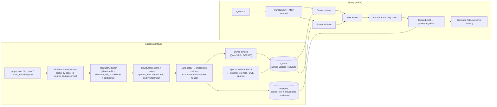
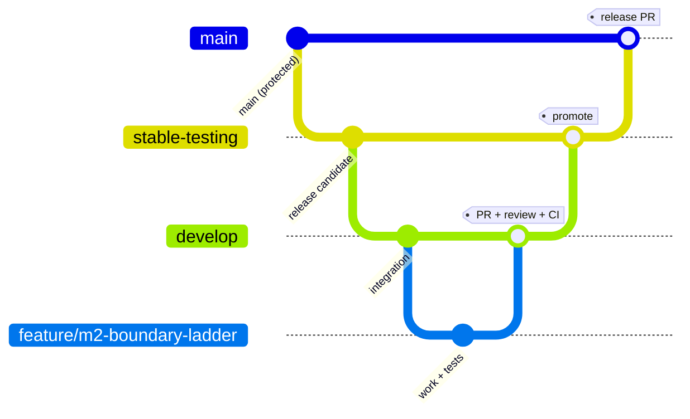

# General Module — Implementation Plan

> **Status: proposed, awaiting approval. No code has been written yet.**
> This revision **aligns the plan with the colleague review notes** in
> [../../review_general_module_chunking_embeddings_brief.md](../../review_general_module_chunking_embeddings_brief.md)
> ("General Module — Confirmed Chunking Mechanism"), which were checked against the corpus sample
> and confirmed. It also incorporates two stack decisions requested by the team: **Qdrant** as the
> vector store and **Qwen3-Embedding-8B** as a first-class embedding candidate. The full issue
> list is in [general_module_issues.md](general_module_issues.md).
>
> The design docs this builds on:
> [15_general_module_chunking_and_embeddings.md](../technical_docs/15_general_module_chunking_and_embeddings.md),
> the [brief](../technical_docs/general_module_chunking_embeddings_brief.md), the ADRs
> ([13_architecture_decisions.md](../technical_docs/13_architecture_decisions.md)), and the
> confirmed chunking mechanism above.

---

## 1. Scope

**In scope:** the end-to-end *general question-answering* path — the open-ended, cross-library
lane that answers questions like "al-Shāfiʿī's view of Mālik", "Ibn Taymiyyah on the Sufis",
"did scholars consider the Qurʾān created". Per [doc 10](../technical_docs/10_ingestion_and_indexing_pipeline.md),
this is also the **fallback path for essentially every book**, so building it well is the
foundation the specialized paths (hadith takhrij, tafsir-by-verse, fiqh) later plug into.

**Out of scope for now:** the graph-traversal paths (isnad/takhrij), tafsir-by-verse joins, and
fiqh madhhab faceting. They reuse this module's ingestion and retrieval plumbing but are separate
milestones.

## 2. Technical decisions (updated per review notes + team requests)

Where a decision **changes** a prior ADR, that is called out — the ADR should be amended to match.

| Area | Decision for this build | Change vs. earlier docs |
|---|---|---|
| **Vector store** | **Qdrant** — one collection with **named vectors** (dense + sparse) and rich payload for metadata filtering + parent/child links. | **Supersedes ADR-001's `pgvector`** for the general module's vectors. Amend ADR-001. |
| **Relational / provenance store** | **PostgreSQL** — source text (`source_text` preserved verbatim), chunk/section records, boundary provenance + confidence, book/author metadata, and (later) the graph tables. | Retained from ADR-001, now alongside Qdrant rather than holding vectors. |
| **Dense embedding model** | Chosen by measurement — head-to-head **`Qwen/Qwen3-Embedding-8B`** vs **`BAAI/bge-m3`** on the golden set (plus optionally one commercial API as a ceiling). | **Updates ADR-002's shortlist** (adds Qwen3-8B as a primary candidate). |
| **Sparse / lexical arm** | Primary = **surface-form BM25** on lightly-normalized Arabic (names/titles stay exact). **Root expansion** only as a separate low-weight field, enabled only if it helps. **BGE-M3 learned sparse** evaluated as an ablation (§ retrieval). | **Resolves the contradiction** the review flagged (BM25 ≠ BGE-M3 learned sparse; they are different arms). |
| **Chunking mechanism** | Structure-first **parent–child**: TOC/inline-title *structural section* is the parent; *embedding chunks* are its bounded children; *returned context* expands a matched child back to parent/neighbors. Per-occurrence **boundary fallback ladder**; body/footnote separation; navigational headings become context nodes. | **Formalizes** the doc-15 "TOC-anchored" idea per the confirmed mechanism. |
| **Chunk sizing (starting values)** | Atomic entry < ~128 tok; coherent section ~128–768 tok = one child; > ~768 tok split into ~384–512-tok paragraph-aligned children; ~64-tok overlap **within the same section only**. | **Updates ADR-004's 512–1024 numbers** to the review's per-unit policy (still tunable). |
| **Retrieval shape** | Hybrid **dense + sparse → RRF → cross-encoder rerank → authority boost → parent/neighbor expansion**. | Unchanged in shape; adds parent expansion. |
| **Query language** | English questions are **translated to Arabic** before retrieval (production path); eval covers native-Arabic and translated-English queries. | New (from review). |

**Language/stack & key deps:** Python (`.venv` exists), `pyproject.toml`; **Qdrant** (`qdrant-client`)
+ **PostgreSQL** via `docker-compose`, Alembic migrations; embeddings via **`FlagEmbedding` (BGE-M3)**
and **`Qwen/Qwen3-Embedding-8B`** (sentence-transformers / vLLM / transformers); an Arabic
title-span/HTML parser for the inline `toc-N` markup; an EN→AR translation component; FastAPI for
the endpoint; `pytest`.

## 3. Architecture recap



## 4. Milestones (build order)

The dependency chain runs top to bottom; within a milestone, most issues can be parallelized.

| # | Milestone | Goal | Key output |
|---|---|---|---|
| **M0** | Project foundation & infra | Repo builds, DBs run, CI green | `src/` package, `docker-compose` (Postgres + Qdrant), migrations, CI |
| **M1** | Data access | Read corpus files into typed models | Loaders + domain models + ordering |
| **M2** | Chunking | Book → correct parent/child chunks | Boundary ladder, structural tree, size policy, context headers |
| **M3** | Embeddings & indexing | Chunks → Qdrant + Postgres | Dense (Qwen3-8B/BGE-M3) + sparse arms, ingestion pipeline |
| **M4** | Retrieval | Question → ranked, expanded passages | Hybrid retriever + rerank + translation + parent expansion |
| **M5** | Generation | Passages → cited answer | Prompt + answer assembly |
| **M6** | Evaluation | Prove it works before scaling | **Golden set (colleague)** + metrics + 3-stage model comparison |
| **M7** | API & integration | Callable end-to-end | FastAPI `/ask` endpoint |
| **M8** | CI/CD & repo hardening | Safe, tested merges | Coverage gate, smoke test, branch protection |

**Critical gate:** no dense model is locked and the full corpus is **not** ingested until M6's
golden set exists and the **three-stage Qwen3-8B vs BGE-M3 comparison** has run (§ M6). M0–M5 build
against **one biography book** (`1021__أسد-الغابة`, category 26 — where "scholar on scholar"
answers live and inline `toc-N` markup is rich) as a fixture, giving an end-to-end smoke test long
before full-scale ingestion.

## 5. Simple/early checkpoints (so we're not flying blind)

- **After M2:** unit tests on Arabic normalization + the boundary ladder; a golden-output test on
  the structural chunker for `1021__أسد-الغابة` (assert boundary sources, confidence, child counts,
  body/footnote split, that source text round-trips).
- **After M3:** ingest **one** book into Qdrant + Postgres; assert named vectors + payload exist and
  a trivial dense query returns something sane.
- **After M5:** single-book end-to-end smoke test — one hand-written question, assert the right
  passage is retrieved, expanded, and cited. (Issue M6-05.)
- **M6:** the real evaluation — golden dataset + the 3-stage retrieval comparison.

## 6. Branching & PR workflow

You created `develop`, `main`, and `stabe-testing`. **Note: `stabe-testing` looks like a typo for
`stable-testing`** (your default integration branch). Proposed model using all three tiers:



- **`feature/<milestone>-<slug>`** → PR → **`develop`** (integration; CI runs here).
- **`develop`** → PR → **`stable-testing`** (release-candidate / pre-prod testing).
- **`stable-testing`** → PR → **`main`** (protected, release-only).

One issue → one branch → one PR → review + green CI → squash-merge. No direct commits to
`develop`/`stable-testing`/`main`.

### 6.1 Fix the branch typo first

```bash
git branch -m stabe-testing stable-testing        # rename locally
git push origin :stabe-testing stable-testing      # delete remote typo (if pushed), push correct name
git push -u origin stable-testing
```
(If `stabe-testing` was never pushed, just the first line + `git push -u origin stable-testing`.)

### 6.2 Manual GitHub setup I need you to do (repo `Ihebdhouibi/Arabic-Islamic-Rag`)

Branch protection can't be set from here — configure it once:

1. **Settings → Branches → Add ruleset (or classic rule)** for **`main`**:
   - Require a PR before merging → **1 approval**; require conversation resolution.
   - Require status checks → select the CI checks (`lint`, `test`) once they've registered.
   - Require branches up to date; block force pushes and deletions; restrict who can push.
2. **Add a rule for `stable-testing`** and **`develop`**: require a PR + passing CI (you can allow 1
   approval on `develop` and require it on `stable-testing`).
3. **Settings → General → Pull Requests:** enable **squash merging**, **auto-delete head branches**.
4. (Optional) set **`develop` as the default branch** so PRs target it by default and `main` stays
   clean for releases.

`gh` equivalent for `main` (you run it; needs repo-admin auth):
```bash
gh api -X PUT repos/Ihebdhouibi/Arabic-Islamic-Rag/branches/main/protection \
  -F required_pull_request_reviews.required_approving_review_count=1 \
  -F enforce_admins=true -F required_status_checks.strict=true \
  -F 'required_status_checks.contexts[]=lint' \
  -F 'required_status_checks.contexts[]=test' -F restrictions=
```

Tell me once the typo is fixed and protection is on, and I'll branch every feature PR off `develop`.

## 7. Definition of done (per issue)

Code + unit tests, lint/type-check clean, PR links the issue, CI green, reviewed, squash-merged
into `develop`. No direct commits to protected branches. Source text must round-trip unchanged
(a hard validation gate for the chunker — see M2/M6).

## 8. What I need from you to start

1. **Approval of this plan** (and the issue list).
2. Confirm the **branch model** in §6 (and fix the `stabe-testing` typo, §6.1).
3. Do the **GitHub branch-protection setup** (§6.2), or ask me for the exact clicks.
4. Assign the **evaluation-dataset issue** (M6-01) to your colleague.

Once approved, I'll start at **M0-01** and open one PR per issue into `develop`.
