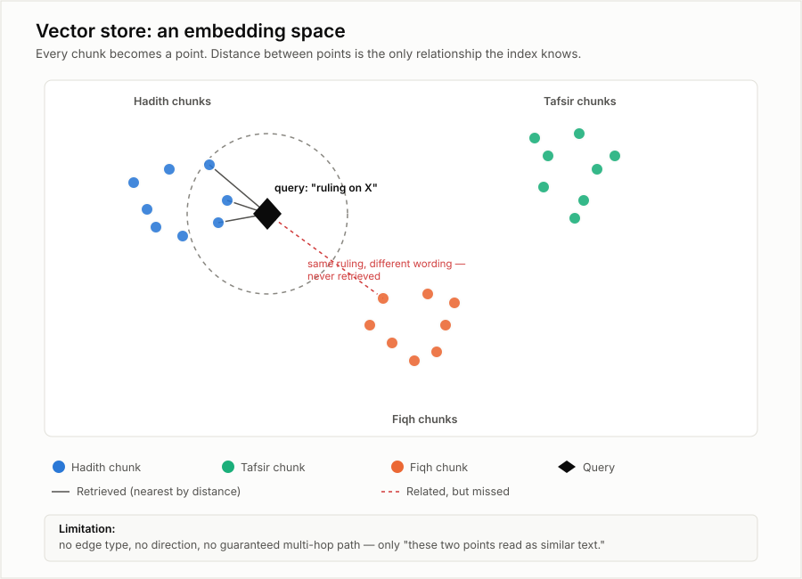
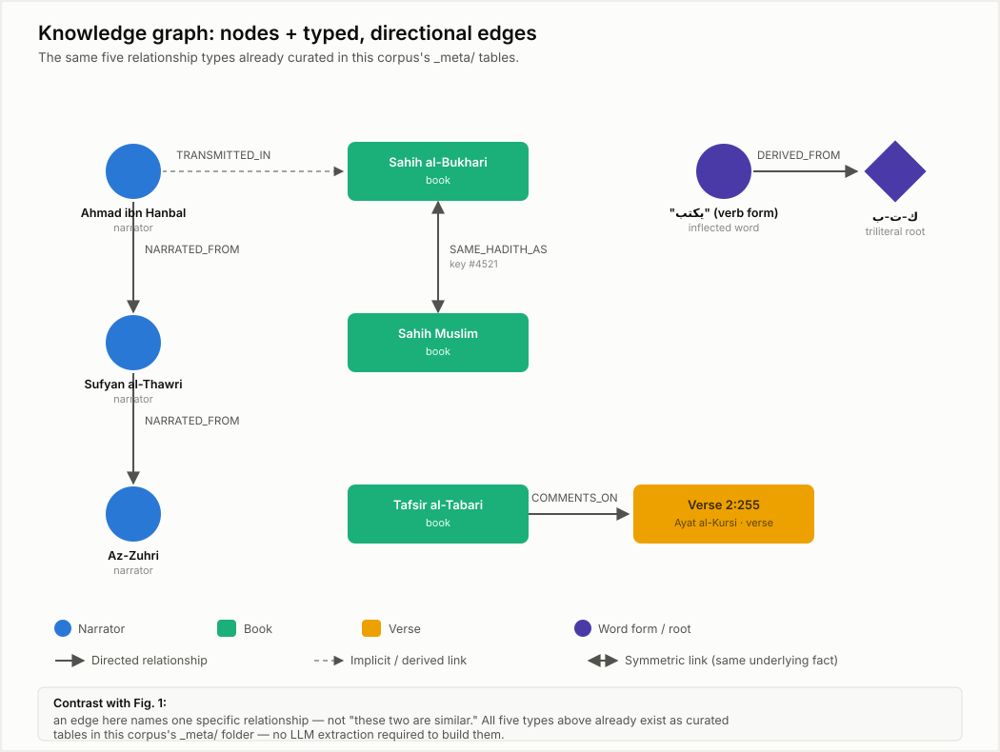
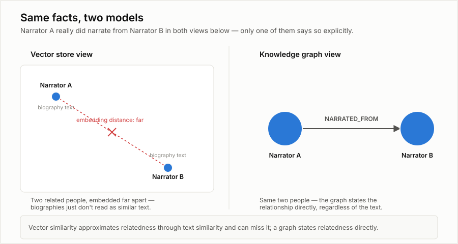
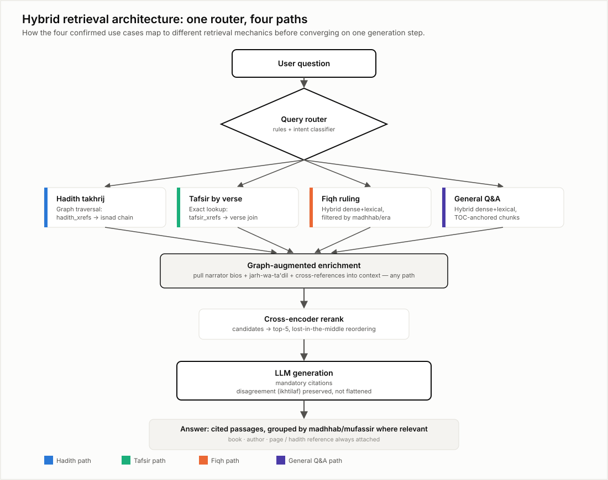
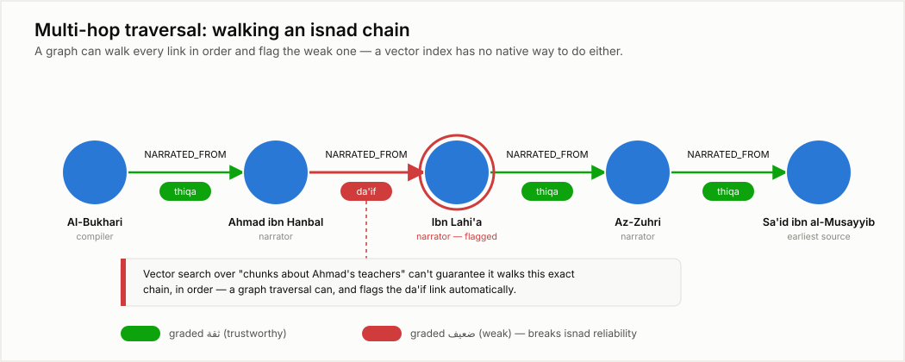

# 08 — Diagrams: Knowledge Graph vs. Vector Store

> Companion figures for [05_knowledge_graphs_and_graphrag.md](05_knowledge_graphs_and_graphrag.md).
> That document explains the concepts in prose; this one shows them. Five standalone SVG figures
> live alongside this file (`08_fig1_...svg` through `08_fig5_...svg`) — open them directly if
> your viewer doesn't render embedded images, or view them inline below.

## Figure 1 — What a vector store actually knows

Every chunk becomes a point in a high-dimensional space (drawn here in 2D for legibility). The
only thing the index can tell you about two points is how close together they are. A query is
just another point; "retrieval" is "find the *k* nearest points."

The red dashed line is the failure case worth internalizing: a fiqh chunk addressing the exact
same ruling as the query, phrased differently, can sit *outside* the retrieved neighborhood —
because "close" here means "reads as similar text," not "is factually related." Vector search
has no concept of an edge, a direction, or a guaranteed traversal path — see
[05_knowledge_graphs_and_graphrag.md §3](05_knowledge_graphs_and_graphrag.md#3-what-vector-similarity-structurally-cannot-do)
for the full list of what this structurally cannot do.

## Figure 2 — What a knowledge graph adds

Same corpus, different structure. Instead of one undifferentiated "closeness" relationship, every
edge is **typed and directional**: `NARRATED_FROM`, `TRANSMITTED_IN`, `SAME_HADITH_AS`,
`COMMENTS_ON`, `DERIVED_FROM`. These five are not hypothetical — they are exactly the five
relationship types already sitting in this corpus's `_meta/` tables
(`narrators.jsonl`, `page_isnads.parquet`, `hadith_xrefs.jsonl`, `tafsir_xrefs.jsonl`,
`root_dictionary.jsonl`), as mapped in
[05_knowledge_graphs_and_graphrag.md §5](05_knowledge_graphs_and_graphrag.md#5-two-very-different-ways-a-graph-comes-into-existence).
Nothing here was extracted by an LLM — it was loaded from data scholars already curated.

## Figure 3 — The same two facts, told two ways

This is the single clearest illustration of the difference. Narrator A really did narrate from
Narrator B in both panels — that fact doesn't change. What changes is whether the *system* knows
it:

- **Left (vector view):** their biography chunks embed far apart, because two people's biographies
  rarely *read* as similar text even when the people are tightly related. Nothing in the vector
  index says "these two are connected."
- **Right (graph view):** the relationship is stored as an explicit, named edge. It doesn't matter
  how the biography text reads — the fact is there, retrievable by traversal, not by hoping
  similarity happens to approximate it.

## Figure 4 — How the four use cases actually get routed

This is the architecture from
[07_recommended_architecture_for_shamela_rag.md §5](07_recommended_architecture_for_shamela_rag.md#5-query-routed-retrieval-one-path-per-use-case)
drawn out: a single question enters through one router, but the four confirmed use cases
(hadith takhrij, tafsir-by-verse, fiqh lookup, general Q&A) take genuinely different retrieval
paths — graph traversal for two of them, hybrid dense+lexical search for the other two — before
converging on a shared graph-augmented-enrichment step, reranking, and a generation step that
must cite its sources. This is the practical answer to "vector or graph?" — it's not a choice
made once for the whole system, it's a per-question routing decision.

## Figure 5 — A concrete multi-hop question, worked through

A worked example of the "multi-hop reasoning" case from
[05_knowledge_graphs_and_graphrag.md §2](05_knowledge_graphs_and_graphrag.md#2-why-graphs-matter-for-retrieval):
tracing an isnad chain link by link and checking each narrator's grading along the way. A graph
traversal does this as a direct, exact walk — five nodes, four typed edges, one flagged as `da'if`
(weak) — and the weak link is caught automatically because grading is an attribute on the edge's
endpoint, not something that has to be *inferred* from how similar two passages read. Asking a
vector index to do the equivalent ("find chunks about who Ahmad ibn Hanbal narrated from, and
check if any are weak") gives you a handful of plausible-looking passages with no guarantee the
full chain was walked, in order, without a gap.

## Takeaway

Figures 1–3 make the conceptual case; figures 4–5 make it concrete for this project specifically.
The recurring pattern: vector search answers *"what does this resemble?"* — the graph answers
*"what is this connected to, exactly, and how?"* A production system over this corpus needs both,
routed by question shape, not a single index asked to do everything.
