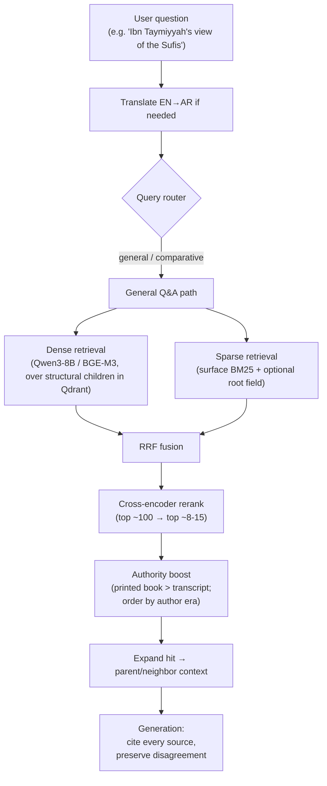

# 15 — General Module: Chunking Strategy & Embeddings Specification

> **Purpose of this document.** A focused, implementation-facing specification of the **chunking
> strategy** and **embedding stack** for the *general question-answering module* of the Shamela
> RAG system. It is deliberately self-contained so it can be read on its own, but it is a
> narrowing of the broader design already recorded in
> [02_chunking_strategies.md](02_chunking_strategies.md),
> [03_embeddings_and_vector_stores.md](03_embeddings_and_vector_stores.md), and
> [07_recommended_architecture_for_shamela_rag.md](07_recommended_architecture_for_shamela_rag.md) —
> not a replacement for them. **This is a design specification, not an implemented system.**

---

## 1. What the general module does

The general module is the open-ended, cross-library reasoning path. It answers questions that are
**not** a single structured lookup (not "trace this hadith's isnad", not "show every mufassir on
verse 2:255", not "what is the Hanbali ruling on X") but rather require **gathering and
synthesizing scattered opinions and statements across many books and authors**.

The three representative queries driving this spec:

1. **"What is the view of Imām al-Shāfiʿī on Imām Mālik?"** — a scholar-on-scholar assessment;
   the answer is spread across biographical works (التراجم والطبقات), fiqh uṣūl discussions, and
   scattered quotations in many unrelated books.
2. **"How did Ibn Taymiyyah view the Sufis?"** — a single author's stance on a movement; the
   answer lives across dozens of his own works and secondary discussions, and is genuinely nuanced
   (he praises some, criticizes others), so the retrieval must surface *range*, not one quote.
3. **"What did the different scholars say about whether the Qurʾān is created or an attribute of
   Allah?"** — the *khalq al-Qurʾān* debate; the answer is a multi-party theological disagreement
   spanning ʿaqīdah works, firaq/heresiography, and biographies across centuries.

### 1.1 Query characteristics that dictate the design

| Property | Consequence for chunking / embeddings |
|---|---|
| **Semantic, not lexical, entry point** | The user names entities ("al-Shāfiʿī", "Sufis", "created Qurʾān") but the relevant passage may never repeat the query's phrasing → dense embeddings are the primary recall mechanism. |
| **Answer is distributed across many books** | Need high recall over a *large* candidate set + reranking to concentrate precision; a single top-1 chunk is never the whole answer. |
| **Entities are exact-term-sensitive** | Scholar names, book titles, sect names, technical ʿaqīdah terms must match exactly → dense alone is insufficient; **hybrid dense + lexical (root-normalized) retrieval is mandatory**, not optional. |
| **Disagreement is the answer** | Retrieval must return *multiple, differing* passages and preserve attribution; the module must not collapse ikhtilāf into one averaged view. |
| **Classical / religious-register Arabic** | Inconsistent diacritics, archaic vocabulary, rich morphology → embedding model choice is an empirical question, and Arabic-aware lexical normalization is a prerequisite (§4). |

The general module is therefore the **hybrid-retrieval, TOC-anchored, reranked** path described in
[07_recommended_architecture_for_shamela_rag.md](07_recommended_architecture_for_shamela_rag.md)
§5 ("General Q&A"). This document fixes concrete parameters for it.

---

## 2. Source data the module chunks

Every book in the corpus provides the three inputs the chunker consumes (verified schema):

- **`pages.jsonl`** — one record per page: `page_id`, `book_id`, `part`, `page_num`,
  `sequence_num`, `body` (the main text), and an optional parallel `footnotes` stream (editor /
  commentary text kept distinct from the base text).
- **`toc.jsonl`** — the **hierarchical table of contents** already mapped to exact page IDs:
  `title_id`, `page_id`, `parent_id` (self-referential → gives the chapter/section tree),
  `title_text`. This is the author/editor-intended section structure, available for free.
- **`book_metadata.json`** — `book_id`, `title_ar`, `main_author_name_ar`, author death year in
  hijri, `category_id` / `category_name_ar`, and `book_type_label` (e.g. `كتاب` printed book vs.
  `دروس مفرغة` transcribed lessons). This becomes per-chunk metadata for filtering and ranking.

The pre-curated `_meta/` graph tables (narrators, isnad, verse↔tafsir, hadith concordance) are
**not** primary inputs to the general module — they power the specialized paths. The general
module only borrows the `narrators` biographical text opportunistically as an authoritative source
genre.

---

## 3. Chunking strategy

### 3.1 Primary strategy: TOC-anchored (structure-aware) chunking

The corpus hands us author-intended boundaries for free through `toc.jsonl`
([02_chunking_strategies.md](02_chunking_strategies.md) §4 — document-structure-aware chunking).
The general module uses the **TOC section (leaf `باب`/`فصل`/entry) as the primary chunk grid**,
not a fixed page or token window. Rationale:

- A TOC section is the closest available proxy for "one coherent idea/discussion", which is
  exactly the unit these opinion-synthesis queries want.
- It carries a **title trail** (parent → child titles) essentially for free, which is invaluable
  both as retrieval signal and as citation ("Kitāb X, chapter Y, page Z").
- It is **cheap and deterministic** — no embedding or LLM calls needed at chunk time.

For **biography-heavy sources** (التراجم والطبقات, الأنساب) — which are disproportionately where
"scholar X on scholar Y" answers live — the TOC is even stronger: one heading typically equals one
person's entry, so a scholar's biographical entry becomes a single self-contained chunk. This
directly serves query 1 above.

### 3.2 Secondary handling (size normalization)

TOC sections vary wildly in length, so two fallback rules apply
([02_chunking_strategies.md](02_chunking_strategies.md) §4, §10):

- **Oversized sections** are sub-split with a **recursive character/structure splitter** tuned for
  Arabic separators (paragraph break `\n\n`, the record's own `\r` line breaks, sentence
  punctuation `. ` / `؛` / `؟`, then whitespace) down to the target size, **with overlap** so an
  argument spanning the cut is not severed.
- **Undersized sections** (a one-line heading) are **merged** with adjacent siblings under the same
  parent until they reach a minimum viable size.

### 3.3 Recommended size parameters (starting point, to be tuned)

| Parameter | Value | Reason |
|---|---|---|
| Target chunk size | **~512 tokens** | General-purpose sweet spot for precision/recall on prose ([02](02_chunking_strategies.md) §10); fits every candidate embedding model's context comfortably. |
| Max chunk size | ~800 tokens | Hard ceiling before forced recursive split. |
| Min chunk size | ~100 tokens | Below this, merge with a sibling. |
| Overlap | **~15% (≈64–80 tokens)** | Preserves cross-boundary context without excessive duplication. |

These are **defaults to validate**, not settled constants — chunk size interacts with the
embedding model and must be swept against the golden eval set
([14_golden_evaluation_dataset.md](14_golden_evaluation_dataset.md)) before being fixed. Whenever
chunk size changes, embeddings must be re-run and retrieval re-measured.

### 3.4 Contextual Retrieval (prepend situating context)

A chunk pulled out of its surrounding `باب`/`فصل` frequently loses its referent — "he held the
opposite", "this view", "the aforementioned imām" become meaningless in isolation, which is
exactly the failure mode these opinion queries are vulnerable to. Two low-cost mitigations, in
priority order:

1. **Cheap, deterministic (do this first):** prepend the **TOC title trail + book title + author +
   author's era** to each chunk's text before embedding and indexing. Free, and already available
   from `toc.jsonl` + `book_metadata.json`. This alone resolves most "which book / whose opinion"
   ambiguity.
2. **LLM-generated contextual header (Anthropic Contextual Retrieval,
   [02](02_chunking_strategies.md) §7):** a 1–2 sentence generated situating note per chunk. Higher
   quality but one LLM call per chunk at ingestion — reserve for a later quality pass, or apply
   selectively to high-value genres, given the 7.6M-page scale.

### 3.5 Matn / footnotes (dual-stream) handling

Where a book provides the parallel `footnotes` stream, keep base text (`body`) and
`footnotes`/commentary as **separate but linked chunks**, not merged
([07](07_recommended_architecture_for_shamela_rag.md) §4). The footnote chunk carries a back-link
to the `body` chunk it annotates so both can surface together at generation time without conflating
two authors' voices in one embedding.

### 3.6 Metadata stored on every chunk

Carried for filtering, ranking, and citation:

`chunk_id`, `book_id`, `book_title_ar`, `author_name_ar`, `author_death_hijri`, `category_id` /
`category_name_ar`, `book_type_label`, `part`, `page_num`, `page_id` range, `toc_title_trail`,
`stream` (`body` | `footnotes`).

`author_death_hijri` and `book_type_label` are what make the module able to (a) order results
chronologically for a debate-history answer like query 3, and (b) **boost authoritative printed
works over transcribed lessons** (`دروس مفرغة`) rather than weighting every source equally
([07](07_recommended_architecture_for_shamela_rag.md) §5).

### 3.7 Why not the alternatives (brief)

- **Fixed-size / page-window chunking** — rejected as the primary grid: it fractures arguments and
  discards the free TOC structure ([02](02_chunking_strategies.md) §1). Used only inside §3.2's
  recursive fallback.
- **Semantic (embedding-breakpoint) chunking** — mixed empirical benefit vs. real cost
  ([02](02_chunking_strategies.md) §3), and blind to domain structure; not worth it when a good
  structural grid already exists.
- **Proposition / agentic LLM chunking** — highest quality but one+ LLM call per passage; not
  viable as the default over millions of pages ([02](02_chunking_strategies.md) §5, §8). Candidate
  for a selective later pass only.

---

## 4. Embeddings

### 4.1 Hybrid retrieval is the baseline, not an upgrade

For this corpus the general module must run **dense + sparse (lexical) retrieval fused with
Reciprocal Rank Fusion (RRF)** ([03](03_embeddings_and_vector_stores.md) §5). Dense embeddings
catch the semantic entry point ("Sufis", "created Qurʾān"); lexical catches the exact-term hits
(scholar names, book titles, sect names) that a single pooled vector blurs. They fail on different,
largely uncorrelated queries, so fusing them recovers cases either misses.

**Arabic-aware lexical normalization is a prerequisite** for the sparse side to earn its place. The
**primary** sparse arm is classical **BM25** on lightly-normalized surface Arabic (diacritic
stripping, alif/hamza/ta-marbuta normalization) so proper names / sect names / book titles stay
exact. **Root normalization** via the pre-curated **`_meta/root_dictionary.jsonl`** (1.95M
inflected-form → triliteral-root entries) is added as a **separate, low-weight expansion field**,
enabled only if it improves labeled retrieval — not folded into the primary index (over-normalizing
blurs the exact-name precision the sparse arm exists to provide).

> **Note — BM25 vs. "BGE-M3 learned sparse":** these are different mechanisms. BM25 is a classical
> lexical index; BGE-M3 also emits a neural *learned-sparse* vector. We use BM25 as the primary
> sparse arm and evaluate BGE-M3 learned-sparse as an ablation (see the implementation plan's M6).
> The confirmed chunking + retrieval mechanism is in
> [../../review_general_module_chunking_embeddings_brief.md](../../review_general_module_chunking_embeddings_brief.md).

### 4.2 Dense embedding model — shortlist and recommendation

Per [03](03_embeddings_and_vector_stores.md) §2–§9, no model has *documented* performance on
classical religious-register Arabic, so this is an **evaluation question, not a leaderboard
lookup**. Start from this shortlist:

| Model | Why shortlisted | Notes |
|---|---|---|
| **`Qwen/Qwen3-Embedding-8B`** | **Primary candidate.** Top open-weight multilingual retrieval performance; strong Arabic coverage; instruction-formatted queries. | Larger (8B) — more GPU/latency/storage; weigh in the operational tradeoff. |
| **`BAAI/bge-m3`** (~560M) | **Primary candidate.** Highest documented score on Arabic RAG incl. a Qurʾān-Tafsīr retrieval task ([arXiv:2506.06339]); 8192-token context; also emits a learned-sparse vector (evaluated separately). | Self-hostable; cheap; small footprint. |
| **Commercial API** (Cohere `embed-v4.0` / Google `gemini-embedding-001`) | Optional ceiling reference. | Per-token cost at scale + data-residency tradeoff. |
| multilingual-e5-large; Arabic-specific (Swan / GATE) | Optional extra baselines if eval time allows. | General multilingual models currently out-perform Arabic-specialized ones on Arabic RAG in the literature. |

**Decision by measurement, not default:** run a **head-to-head of Qwen3-Embedding-8B vs. BGE-M3** on
the golden set (same chunks, same questions, reranker fixed), then pick on retrieval quality first
and operational tradeoff (latency/storage/cost) second. Only the winner embeds the full corpus (see
the implementation plan's M6 three-stage comparison).

### 4.3 Reranking (second stage)

Hybrid retrieval optimizes recall over a large candidate set; a **cross-encoder reranker** then
concentrates precision on the shortlist (top ~50–100 → top ~8–15)
([03](03_embeddings_and_vector_stores.md) §8). This matters more than usual here because the answer
is assembled from *several* passages, so the reranked top-k must be both relevant *and* diverse
across authors/positions. Candidates: **BGE-reranker-v2-m3** (pairs naturally with BGE-M3),
Cohere Rerank, or Jina Reranker.

### 4.4 Vector store, dimensions, and cost levers

- **Store: Qdrant** (team decision) — one collection with **named dense + sparse vectors** and rich
  payload for metadata filtering and parent/child links, so both retrieval arms and the
  parent-context expansion live in one place. **PostgreSQL** holds the verbatim source text,
  chunk/section provenance, and book metadata alongside it.
- **Matryoshka truncation** ([03](03_embeddings_and_vector_stores.md) §3): if storage or query
  latency becomes a bottleneck, truncate the validated model's vectors before switching to a smaller
  model — a cheap first lever for a corpus this size (especially relevant for the 8B Qwen3 vectors).

---

## 5. End-to-end flow for the general module

**Ingestion side** (offline): order pages by `page_id` → detect boundaries via the fallback ladder
(inline `toc-N` → `shamela_title_id`, with recovery/fallbacks) → build structural sections + context
(parent) → split into embedding children per the size policy → prepend the compact Arabic context
header → dense-embed (Qwen3-8B / BGE-M3) + surface-BM25 encode → upsert to **Qdrant**; store verbatim
source text + provenance in **Postgres**.

---

## 6. Validate before committing (do not skip)

Every recommendation above is a **starting hypothesis**. Per
[03](03_embeddings_and_vector_stores.md) §9 and
[14_golden_evaluation_dataset.md](14_golden_evaluation_dataset.md), before fixing the chunking
params or embedding model at full scale:

1. Build a **small golden set (50–150 general-module queries)** — scholar-on-scholar assessments,
   single-author stances, multi-party theological/fiqh debates (exactly the three example types) —
   with the correct source passages hand-labeled.
2. Measure **Recall@k and NDCG@k** at the k the generation stage will actually use.
3. **A/B the shortlist**: at minimum BGE-M3 vs. multilingual-e5-large vs. one commercial API, all
   on identical chunks.
4. **A/B dense-only vs. sparse-only vs. RRF-fused** to confirm hybrid earns its complexity on this
   corpus.
5. **Sweep chunk size** (e.g. 256 / 512 / 800 tokens) and **re-embed** whenever it changes —
   results don't transfer across chunking schemes.

---

## 7. Summary of decisions

| Area | Decision (starting point) |
|---|---|
| Primary chunk unit | **TOC-anchored section** (`toc.jsonl` hierarchy), biography = one entry per person |
| Fallback | Arabic-tuned recursive split for oversized sections; merge undersized siblings |
| Chunk size / overlap | ~512 tokens target, ~800 max, ~100 min, ~15% overlap — **to be tuned** |
| Context preservation | Prepend TOC title-trail + book/author/era (free); LLM contextual header later |
| Matn vs. footnotes | Separate but linked chunks |
| Retrieval | **Hybrid dense + sparse, RRF-fused**, then cross-encoder rerank |
| Dense model | **BGE-M3** (default), evaluate vs. multilingual-e5-large + a commercial API |
| Lexical normalization | Diacritic/hamza normalization + root normalization via `_meta/root_dictionary.jsonl` |
| Reranker | BGE-reranker-v2-m3 (or Cohere / Jina) |
| Vector store | Qdrant / OpenSearch at scale; pgvector if relational-first and <~tens of millions |
| Ranking signal | Boost printed works over transcripts; order by `author_death_hijri` for debate history |
| Generation constraint | Cite every source; preserve disagreement; do not act as an independent authority |
| Gate | Validate all of the above on a golden eval set **before** full-scale ingestion |

---

## Further reading (this repo)

- [02_chunking_strategies.md](02_chunking_strategies.md) — full survey of chunking strategies.
- [03_embeddings_and_vector_stores.md](03_embeddings_and_vector_stores.md) — embedding models,
  hybrid retrieval, vector stores, evaluation methodology.
- [04_retrieval_and_query_strategies.md](04_retrieval_and_query_strategies.md) — routing,
  reranking, query strategies.
- [07_recommended_architecture_for_shamela_rag.md](07_recommended_architecture_for_shamela_rag.md)
  — the four-use-case architecture this module lives inside.
- [14_golden_evaluation_dataset.md](14_golden_evaluation_dataset.md) — the evaluation set to
  validate these choices.
