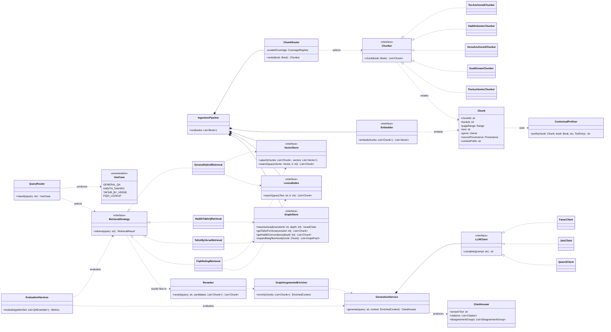

# Class Diagram — Proposed System Architecture

> Part of the diagram set indexed in [../12_architectural_diagrams.md](../12_architectural_diagrams.md).
> This translates the architecture described in prose across
> [02_chunking_strategies.md](../02_chunking_strategies.md),
> [05_knowledge_graphs_and_graphrag.md](../05_knowledge_graphs_and_graphrag.md),
> [07_recommended_architecture_for_shamela_rag.md](../07_recommended_architecture_for_shamela_rag.md),
> and [10_ingestion_and_indexing_pipeline.md](../10_ingestion_and_indexing_pipeline.md) into a
> concrete class structure. **This is a design sketch, not committed code** — class and method
> names are illustrative of responsibilities, not a locked-in API.

*Rendered from [`class_diagram_system_architecture.mmd`](class_diagram_system_architecture.mmd) —
edit that source and re-render as the design evolves. Mermaid source reproduced below for inline
reference.*

## Design decisions this diagram makes concrete

- **`ChunkRouter` is a real class, not a config file**, because chunking strategy depends on two
  things a simple category lookup can't fully capture: genre *and* curated-coverage membership
  (per [10 §1](../10_ingestion_and_indexing_pipeline.md#1-finding-curated-graph-coverage-is-narrower-than-category-boundaries-suggest)
  — a category-06 book outside the 10 curated hadith sources still needs `TocAnchoredChunker`, not
  `HadithAtomicChunker`, since there's no isnad data behind it). That routing logic deserves its
  own component with its own tests, not a lookup table sprinkled through ingestion code.
- **`Chunk.sourceProvenance`** exists specifically because of
  [11_extending_extraction_coverage.md §4](../11_extending_extraction_coverage.md#4-provenance-matters-once-coverage-is-mixed-confidence) —
  once extracted (not just curated) graph edges exist, every chunk built from graph data needs to
  carry whether it's scholar-curated or automatically inferred, all the way through to the
  generation step.
- **`RetrievalStrategy` has four concrete implementations, not one parameterized class**, because
  the four use cases genuinely compose the underlying stores differently (per
  [07 §5](../07_recommended_architecture_for_shamela_rag.md#5-query-routed-retrieval-one-path-per-use-case)) —
  `HadithTakhrijRetrieval` and `TafsirByVerseRetrieval` go straight to `GraphStore` for exact
  lookups, while `GeneralHybridRetrieval` and `FiqhRulingRetrieval` combine `VectorStore` and
  `LexicalIndex`. Forcing these into one class with branching logic would hide that they're
  answering structurally different questions (per
  [05_knowledge_graphs_and_graphrag.md §2](../05_knowledge_graphs_and_graphrag.md#2-why-graphs-matter-for-retrieval)).
- **`GraphAugmentedEnricher` sits after every retrieval path, not just the graph-native ones** —
  per [05 §7](../05_knowledge_graphs_and_graphrag.md#7-hybrid-graph--vector-rag)'s "neighborhood
  expansion" pattern, even a plain vector-search hit in `GeneralHybridRetrieval` should have its
  graph neighborhood (narrator bios, cross-references) pulled in before generation.
- **`LLMClient` is an interface with swappable implementations** on purpose, so the two-model
  split proposed in
  [09_open_source_arabic_llms.md §5](../09_open_source_arabic_llms.md#5-a-two-model-split-is-a-legitimate-pattern-here)
  (a cheap model for `QueryRouter`, a larger Arabic-aligned model for `GenerationService`) is a
  configuration choice, not a structural rewrite.
