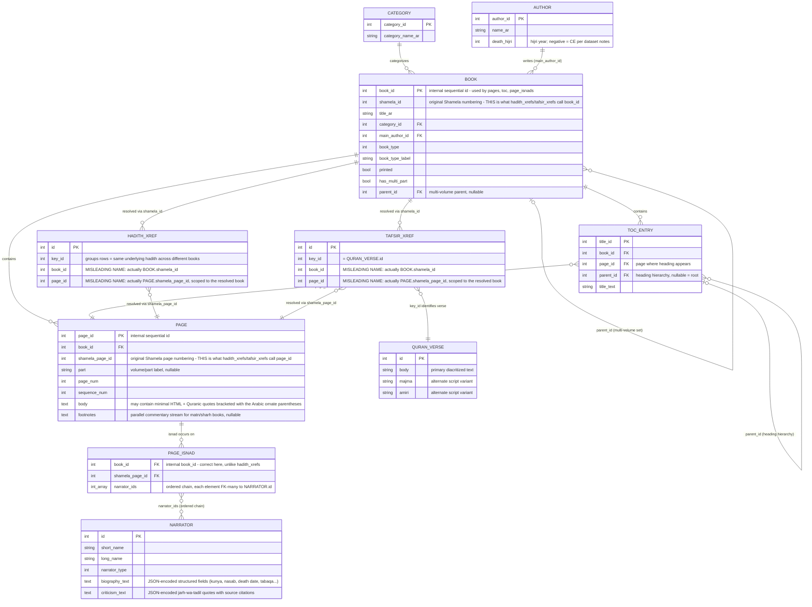

# ERD — Shamela4 Data Model

> Part of the diagram set indexed in [../12_architectural_diagrams.md](../12_architectural_diagrams.md).
> Grounded in the actual schemas inspected across docs 05, 10, and 11 — including the
> `shamela_id`/`shamela_page_id` join gotcha from
> [10_ingestion_and_indexing_pipeline.md §2](../10_ingestion_and_indexing_pipeline.md#2-finding-hadith_xrefs-and-tafsir_xrefs-key-on-a-different-id-space-than-the-rest-of-the-corpus),
> baked directly into the field comments below so it can't be missed by whoever builds against
> this diagram.

*Rendered from [`erd_data_model.mmd`](erd_data_model.mmd) — edit that source and re-render if
the schema understanding changes. Mermaid source reproduced below for inline reference.*

## Notes that don't fit cleanly into ER notation

- **`HADITH_XREF.key_id` is a grouping value, not a foreign key to a separate table.** Rows sharing
  the same `key_id` represent the same underlying hadith appearing in different books — the
  "SAME_HADITH_AS" edge from
  [08_fig2_knowledge_graph_structure.svg](../08_fig2_knowledge_graph_structure.svg) is built by
  grouping `HADITH_XREF` rows by `key_id` after resolving the book/page IDs, not by joining to
  another table.
- **`ROOT_DICTIONARY` (token → triliteral root) is intentionally omitted above.** It's a flat
  lookup table (`token`, `roots[]`) consulted at index/query time for root-normalized lexical
  search (per
  [03_embeddings_and_vector_stores.md §5](../03_embeddings_and_vector_stores.md#5-sparse-and-hybrid-representations)),
  not a relationship to any specific page or book — including it as an ER relationship would
  misrepresent a lexical lookup as a real join.
- **Curated coverage is a subset, not a property visible in this schema.** `PAGE_ISNAD` only has
  rows for 10 books and `TAFSIR_XREF` only for 9, out of 1,241 and 273 candidates respectively
  (per [10_ingestion_and_indexing_pipeline.md §1](../10_ingestion_and_indexing_pipeline.md#1-finding-curated-graph-coverage-is-narrower-than-category-boundaries-suggest)).
  The ER diagram shows what the relationship *looks like where it exists* — it doesn't show that
  it's sparse. Don't assume a `BOOK` row has isnad/tafsir coverage just because its category
  suggests it should.
