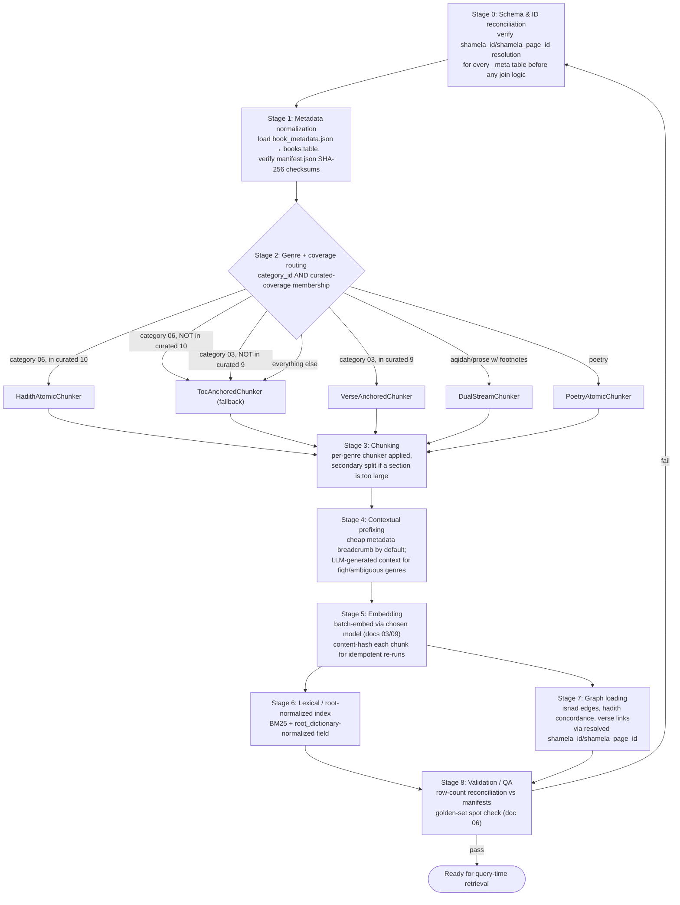

# Flowchart — Ingestion & Indexing Pipeline

> Part of the diagram set indexed in [../12_architectural_diagrams.md](../12_architectural_diagrams.md).
> Visualizes the 9 stages from
> [10_ingestion_and_indexing_pipeline.md §3](../10_ingestion_and_indexing_pipeline.md#3-pipeline-stages),
> with the two data findings from that document (§1–2) shown as explicit decision/branch points
> rather than buried in prose.

*Rendered from [`flowchart_ingestion_pipeline.mmd`](flowchart_ingestion_pipeline.mmd) — edit that
source and re-render if the pipeline design changes. Mermaid source reproduced below for inline
reference.*

## Reading notes

- **Stage 2 is drawn as a decision diamond, not a straight arrow**, because it's the stage where
  [10 §1](../10_ingestion_and_indexing_pipeline.md#1-finding-curated-graph-coverage-is-narrower-than-category-boundaries-suggest)'s
  finding actually gets enforced: category membership alone is not sufficient to pick
  `HadithAtomicChunker`/`VerseAnchoredChunker` — a book also has to be in the resolved
  curated-coverage set, or it falls back to `TocAnchoredChunker` like any general book.
- **Stages 5 (embedding) and 7 (graph loading) run independently off Stage 4/3** — nothing about
  loading the curated graph tables depends on embeddings existing yet, so these can run in
  parallel rather than strictly sequentially, both feeding into the shared Stage 8 validation.
- **Stage 8 loops back to Stage 0 on failure**, not forward — per
  [10 §6](../10_ingestion_and_indexing_pipeline.md#6-what-was-actually-verified-vs-still-assumed),
  the kind of failure this pipeline is specifically designed to catch (a silent join mismatch like
  the `shamela_id` gotcha) traces back to a Stage 0 assumption that needs re-checking, not a
  downstream bug to patch locally.
