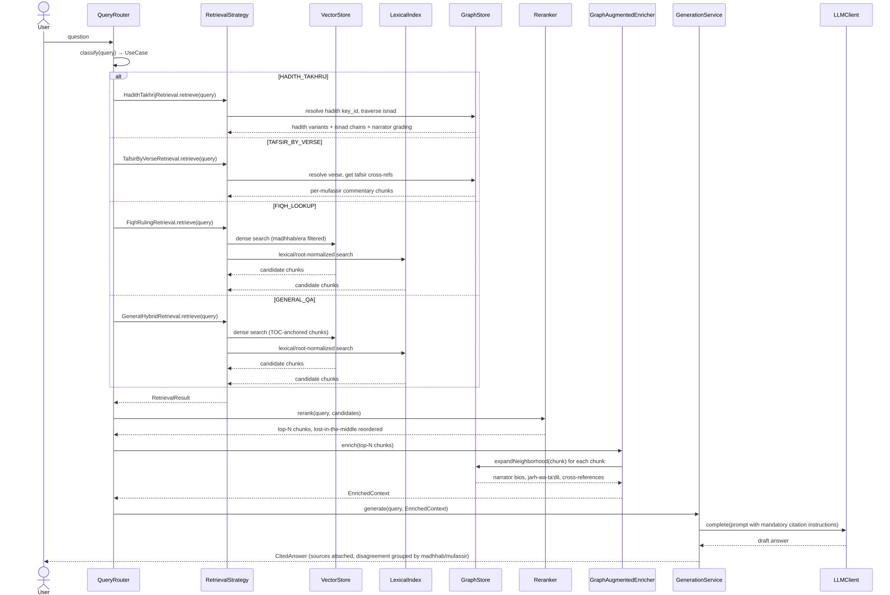

# Sequence Diagram — Query-Time Lifecycle

> Part of the diagram set indexed in [../12_architectural_diagrams.md](../12_architectural_diagrams.md).
> Shows one question traveling through the router, one of the four retrieval paths from
> [07_recommended_architecture_for_shamela_rag.md §5](../07_recommended_architecture_for_shamela_rag.md#5-query-routed-retrieval-one-path-per-use-case),
> and the shared enrichment/generation steps. Complements
> [08_fig4_hybrid_retrieval_architecture.svg](../08_fig4_hybrid_retrieval_architecture.svg), which
> shows the same architecture as a static diagram; this shows it as a time-ordered interaction.

*Rendered from [`sequence_query_lifecycle.mmd`](sequence_query_lifecycle.mmd) — edit that source
and re-render as the design evolves. Mermaid source reproduced below for inline reference.*

```mermaid
sequenceDiagram
    actor User
    participant QR as QueryRouter
    participant RS as RetrievalStrategy
    participant VS as VectorStore
    participant LX as LexicalIndex
    participant GS as GraphStore
    participant RR as Reranker
    participant EN as GraphAugmentedEnricher
    participant GEN as GenerationService
    participant LLM as LLMClient

    User->>QR: question
    QR->>QR: classify(query) → UseCase

    alt HADITH_TAKHRIJ
        QR->>RS: HadithTakhrijRetrieval.retrieve(query)
        RS->>GS: resolve hadith key_id, traverse isnad
        GS-->>RS: hadith variants + isnad chains + narrator grading
    else TAFSIR_BY_VERSE
        QR->>RS: TafsirByVerseRetrieval.retrieve(query)
        RS->>GS: resolve verse, get tafsir cross-refs
        GS-->>RS: per-mufassir commentary chunks
    else FIQH_LOOKUP
        QR->>RS: FiqhRulingRetrieval.retrieve(query)
        RS->>VS: dense search (madhhab/era filtered)
        RS->>LX: lexical/root-normalized search
        VS-->>RS: candidate chunks
        LX-->>RS: candidate chunks
    else GENERAL_QA
        QR->>RS: GeneralHybridRetrieval.retrieve(query)
        RS->>VS: dense search (TOC-anchored chunks)
        RS->>LX: lexical/root-normalized search
        VS-->>RS: candidate chunks
        LX-->>RS: candidate chunks
    end

    RS-->>QR: RetrievalResult
    QR->>RR: rerank(query, candidates)
    RR-->>QR: top-N chunks, lost-in-the-middle reordered

    QR->>EN: enrich(top-N chunks)
    EN->>GS: expandNeighborhood(chunk) for each chunk
    GS-->>EN: narrator bios, jarh-wa-ta'dil, cross-references
    EN-->>QR: EnrichedContext

    QR->>GEN: generate(query, EnrichedContext)
    GEN->>LLM: complete(prompt with mandatory citation instructions)
    LLM-->>GEN: draft answer
    GEN-->>User: CitedAnswer (sources attached, disagreement grouped by madhhab/mufassir)
```

## Reading notes

- **The four branches only differ in the retrieval step** — everything after `RetrievalResult`
  (reranking, graph-neighborhood enrichment, generation) is shared, per
  [07 §5](../07_recommended_architecture_for_shamela_rag.md#5-query-routed-retrieval-one-path-per-use-case)'s
  "graph-augmented enrichment across all four paths." The sequence diagram makes this converge
  visually where the class diagram's arrows could make it look like four fully separate flows.
- **`GraphStore` appears in every branch, not just the two graph-native ones** — even
  `FIQH_LOOKUP` and `GENERAL_QA`, which retrieve from `VectorStore`/`LexicalIndex`, still route
  through `EN->>GS: expandNeighborhood` afterward. This is the same point the class diagram makes
  structurally: neighborhood expansion isn't optional for the "vector" paths.
- **The final message back to `User` explicitly carries grouped disagreement**, not just an
  answer string — a reminder that
  [07 §6](../07_recommended_architecture_for_shamela_rag.md#6-generation-and-grounding--a-domain-specific-requirement-not-a-nice-to-have)'s
  citation/disagreement-preservation requirement has to survive all the way through this sequence,
  not get flattened at the `GenerationService` step.
