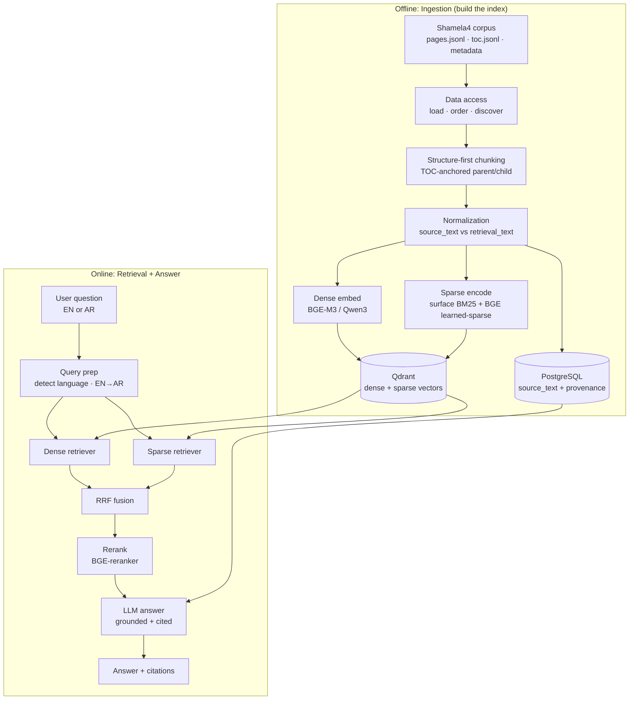
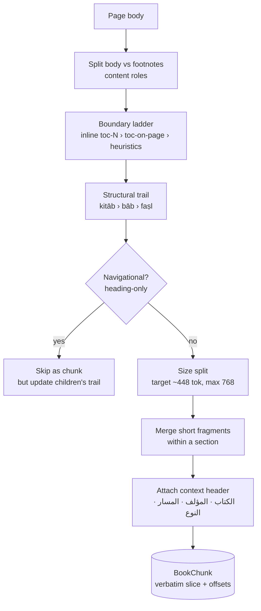
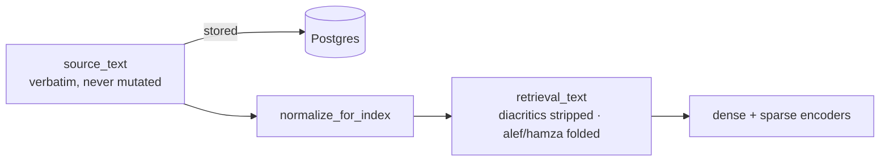
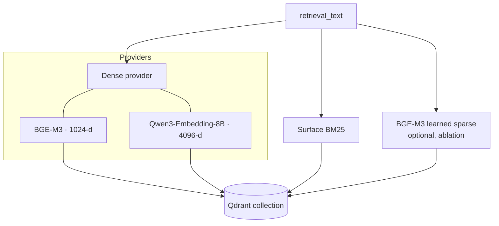
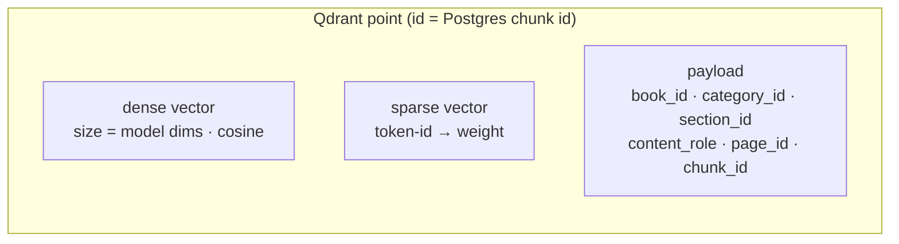
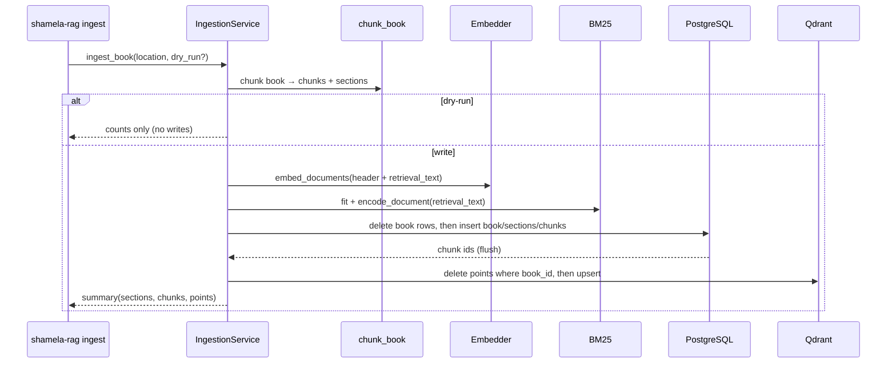
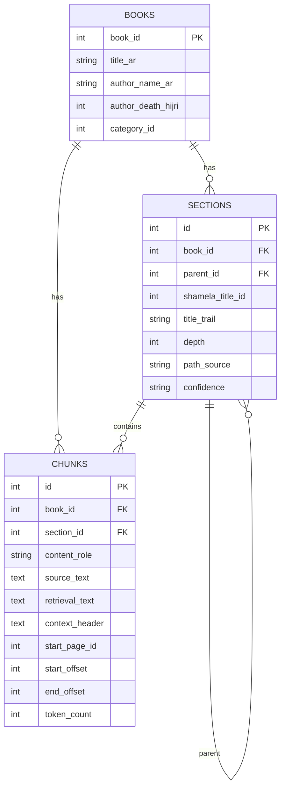
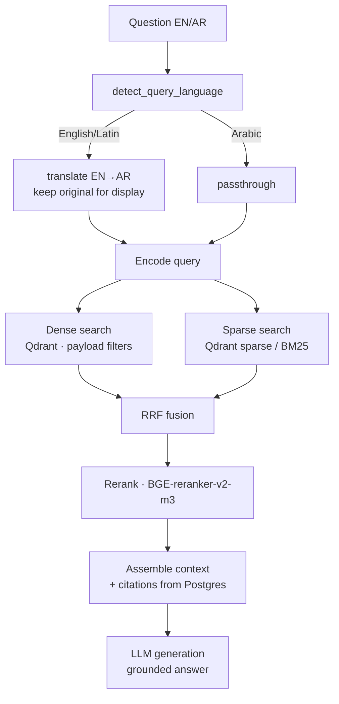
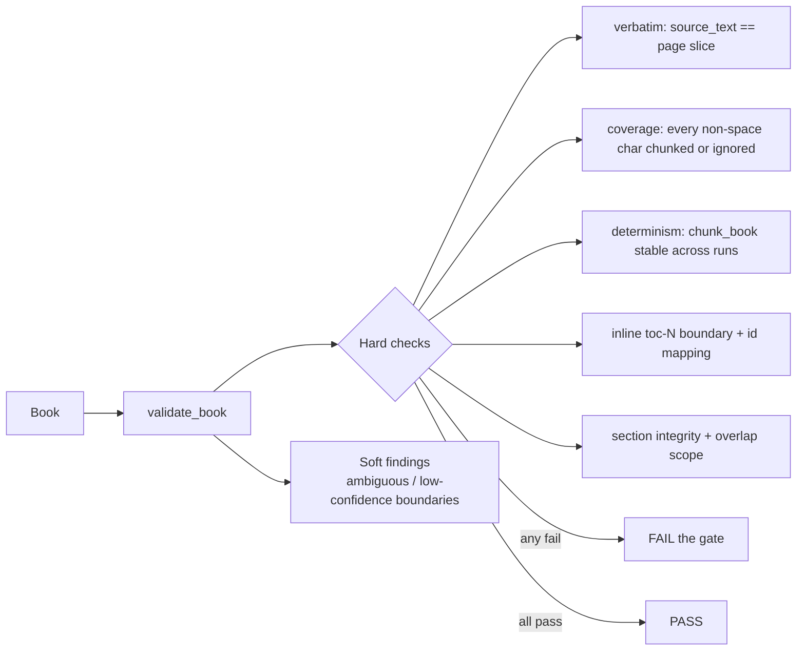
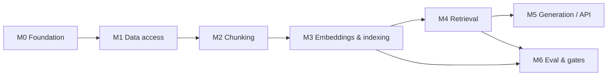

# General Question-Answering Module — Approach (Start to End)

> Audience: contributors joining the general QA module of **Arabic-Islamic-RAG** (RAG / GraphRAG
> over the Shamela4 classical-Arabic corpus). This document explains *what we are building and why*,
> the end-to-end pipeline, the data and storage model, the quality gates, and the milestone roadmap.
> Diagrams are Mermaid; they render on GitHub.

---

## 1. Goal and problem shape

We answer natural-language questions over a large corpus of classical Arabic Islamic books
(Shamela4). Questions are often **comparative or opinion-style**, e.g.:

- "What was al-Shāfiʿī's view of Mālik?"
- "What did Ibn Taymiyyah say about the Sufis?"
- "Was the Qurʾān created?"

These require retrieving the *right passages* from the *right books*, preserving **exact attribution**
(book, author, section path, page), and generating a grounded answer. Two properties dominate every
design decision:

1. **Fidelity / attribution.** The source text must round-trip **verbatim** — we never mutate the
   stored corpus text. A separate normalized field is used only for matching.
2. **Structure awareness.** Classical books are deeply structured (kitāb → bāb → faṣl …). Retrieval
   and chunking are anchored to that structure via the table of contents (TOC).

**Stack:** Python · PostgreSQL (relational / provenance) · Qdrant (vectors) · embeddings
Qwen3-Embedding-8B / BGE-M3 (final choice by measurement) · hybrid dense + surface-BM25 retrieval ·
FastAPI.

---

## 2. End-to-end architecture



The system has two halves: an **offline ingestion** path that turns books into an index, and an
**online retrieval** path that answers questions against it.

---

## 3. Data access layer

The corpus on disk is laid out per book:

```
<root>/<NN>__<category>/<book_id>__<title>/
    ├── pages.jsonl          # page_id, body, footnotes, ...
    ├── toc.jsonl            # title_id, parent_id, page_id, title_text, ...
    └── book_metadata.json   # book_id, title_ar, author, category, ...
```

- **Discovery** walks `root → NN__category → id__book`, skips non-book folders (`docs/`, `_meta/`),
  and reports a book missing any required file rather than dropping it silently.
- **Loaders** are *tolerant*: malformed JSONL lines are skipped, not fatal.
- **Models** (`Book`, `Page`, `TocEntry`) distinguish **internal ids** (our `page_id`, `title_id`)
  from **Shamela ids** (`shamela_page_id`, `shamela_title_id`) so provenance is unambiguous.
- **Ordering** sorts pages into a single stream with per-page character offsets.

---

## 4. Structure-first chunking (the heart of M2)

We do **not** blindly split text every N tokens. Instead we reconstruct the book's structure and
chunk *within* it, so a chunk never silently crosses a section boundary and always knows its path.



Key ideas:

- **Boundary ladder** (highest confidence first): explicit inline `toc-N` spans → TOC entries on the
  page → heuristic headings. Each boundary carries a **confidence** (high/medium/low) recorded for
  later evaluation.
- **TOC-anchored trail.** Every chunk carries its section path (`trail`), derived from the TOC tree.
  Leaf entries with a missing `parent_id` are attached to the nearest preceding heading and marked
  `derived_order` (vs `explicit_parent`) so a guessed nesting is never mistaken for a real one.
- **Verbatim offsets.** A chunk stores `(page_id, start_offset, end_offset)` into the page's body or
  footnotes; `source_text` is exactly that slice. This is the round-trip guarantee.
- **Context header** is stored *separately* so how much of it feeds the embedding can be A/B tested.

### 4.1 Two text fields per chunk



`normalize_for_index` strips tashkeel/tatweel and folds alef/hamza/ta-marbuta/alef-maksura so
diacritized and bare spellings match. It deliberately does **not** do root normalization — that is a
separate, gated expansion field (see §6.3).

---

## 5. Embeddings and the vector index

We combine a **dense** semantic arm and a **sparse** lexical arm — hybrid retrieval consistently
beats either alone, especially for exact names/terms (scholars, sects, book titles).



- **Dense providers** share one interface (`EmbeddingProvider`): `embed_documents`, `embed_query`,
  `dims`, `tokenizer`, `query_instruction`. Backends: **BGE-M3** (1024-d, default) and
  **Qwen3-Embedding-8B** (4096-d, official `Instruct: … Query:` template). Heavy model weights load
  lazily; an in-memory deterministic provider makes tests fully offline.
- **Surface BM25** is the *primary* sparse arm: fit IDF + average length on lightly-normalized
  surface tokens (names/titles stay precise), then emit Qdrant sparse vectors. Full BM25 weight sits
  on the document side and query terms are binary, so a sparse dot product reproduces the BM25 score.
- **BGE-M3 learned sparse** is available behind a flag for the M6 ablation.

### 5.1 Qdrant schema

One collection holds **named vectors** per point plus a filterable payload:



Payload fields `book_id / category_id / content_role` are indexed for fast filtering. The point id
equals the Postgres chunk id, so a vector hit joins straight back to its authoritative row.

---

## 6. Ingestion pipeline (idempotent, resumable)



- **Idempotent:** each run *replaces* a book's Postgres rows and Qdrant points (delete-by-book →
  insert), so re-ingesting never duplicates.
- **Resumable:** `ingest_corpus(skip_existing=True)` skips books that already have chunks; a per-book
  failure is logged and does not abort the run.
- **dry-run:** chunks and counts without writing.
- **CLI:** `shamela-rag ingest --book <id> | --category <id> | --all [--limit N] [--dry-run]
  [--model bge-m3|qwen3]`.

### 6.1 Root-expansion field (separate, low-weight, gated)

An Arabic **root dictionary** (~1.95M inflected-form → root(s) entries) is loaded into an in-memory
lookup. It powers a *separate, low-weight* sparse expansion field, **disabled by default** and
enabled only if it improves labeled retrieval in M6. It is intentionally **not** part of the primary
surface field, so exact-form matching stays sharp.

---

## 7. Storage model



- **PostgreSQL** is the source of truth for verbatim text + provenance (books, sections, chunks).
- **Qdrant** holds the vectors; each point references its Postgres chunk id.
- Split fields — `source_text` (verbatim) vs `retrieval_text` (normalized) vs `context_header` —
  keep fidelity, matching, and embedding-input tuning independent.

---

## 8. Online retrieval and answering



- **Query prep** (done): detect language; English (and mixed Latin+Arabic) questions are translated
  to Arabic for retrieval while the original is preserved for display and eval parity. Arabic passes
  through. A pluggable `Translator` interface with an offline test double keeps this testable.
- **Retrieval** (next): dense NN + sparse search over Qdrant with payload filters, fused with
  **Reciprocal Rank Fusion**, then **reranked**.
- **Generation** (later): an LLM produces a grounded answer with citations resolved back to Postgres
  provenance (book, author, section path, page). The LLM provider sits behind an interface, mirroring
  the embedding-provider pattern.

---

## 9. Quality gates

Because fidelity is non-negotiable, structural correctness is enforced by an automated harness
(`shamela-rag validate-structure`), separate from unit tests:



**Hard** violations fail the run; **soft** findings (ambiguous/low-confidence boundaries,
heading-recovery candidates) are reported for tuning but don't block. The verbatim check is the
codified form of our "source text round-trips unchanged" rule.

Every change also passes: `pre-commit` (ruff lint + format, hygiene, conventional commits), `mypy`
strict, and CI (lint + test with Postgres + Qdrant services).

---

## 10. Milestone roadmap and status



| Milestone | Scope | Status |
|-----------|-------|--------|
| **M0** Foundation | scaffold, docker-compose, config, logging, migrations, CI | Done |
| **M1** Data access | loaders, models, ordering, routing, discovery | Done |
| **M2** Chunking | normalization, title-spans, boundaries, sections, sizing, merge, context header, orchestrator | Done |
| **M3** Embeddings & indexing | Qdrant schema, BGE-M3, Qwen3, surface BM25, **ingestion + CLI**, root-dict loader | Mostly done; root **field** (gated) pending |
| **M4** Retrieval | query translation (done), dense, sparse, RRF fusion, rerank | Translation done; retrievers next |
| **M5** Generation / API | LLM provider (interface done), grounded answering, FastAPI | Upcoming |
| **M6** Eval & gates | structural validation (done), golden dataset, ablations, tuning | Structural gate done |

### What is runnable today

```bash
# Ingest one book (or a category / everything) into Postgres + Qdrant
shamela-rag ingest --book 1021 --model bge-m3
shamela-rag ingest --category 3 --limit 50
shamela-rag ingest --all --dry-run

# Audit chunking fidelity/structure
shamela-rag validate-structure --book-dir path/to/book
shamela-rag validate-structure --corpus-root . --limit 20
```

---

## 11. Conventions (quick reference)

- **Branching:** `main` ← `stable-testing` ← `develop` ← `feature/*` (one issue = one branch = one
  squash-merged PR into `develop`).
- **Commits:** `feat|chore|docs|tests|bug: <short imperative subject>`.
- **No AI attribution, no emojis** anywhere (code, commits, PRs, docs).
- **Definition of done:** code + tests, pre-commit clean, CI green, PR links its issue, reviewed; the
  source text round-trips verbatim through the chunker (hard gate).
```
