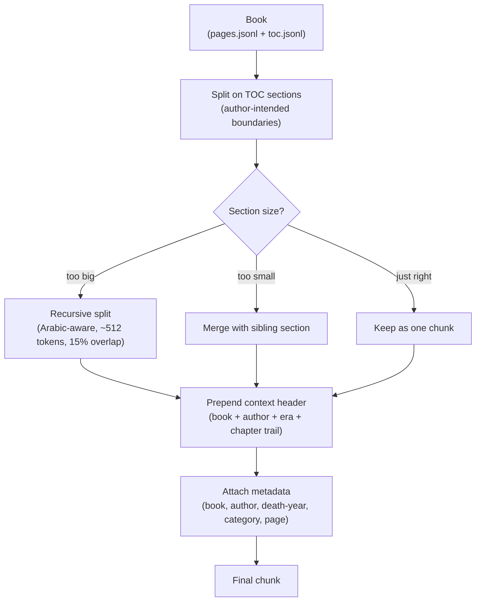
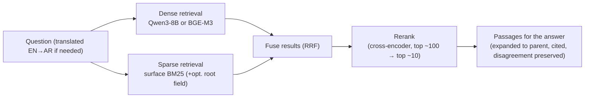

# General Module — Chunking & Embeddings

> **how will we chunk the corpus and embed it for the
> general question-answering module?** Focused only on those two decisions. .

---

## What the general module has to answer

Open-ended questions where the answer is **scattered across many books and authors** and must be
gathered and compared — for example:

- *What was Imām al-Shāfiʿī's view of Imām Mālik?*
- *How did Ibn Taymiyyah view the Sufis?*
- *What did different scholars say about whether the Qurʾān is created?*

These are **semantic** (the user names ideas/people, not exact phrases), **multi-source** (no
single passage is the whole answer), and **exact-term-sensitive** (scholar names, sect names,
book titles must match precisely). Those three facts decide everything below.

---

## 1. Chunking

**The unit of retrieval = one Table-of-Contents section**, not a fixed page or token window.

Every book already ships a hierarchical table of contents (`toc.jsonl`) mapped to exact pages.
That gives us author-intended boundaries **for free** — a `باب` / `فصل` / biographical entry is the
closest thing to "one coherent idea," which is exactly the unit these questions want. For
biography books (where "scholar X on scholar Y" answers live), one heading = one person's entry.

**Why the context header matters.** A chunk taken out of its chapter often says "he held the
opposite" or "this view" with no referent. So before indexing, we prepend the book title, author,
era, and chapter trail to each chunk — all available for free from the metadata. This is what lets
the module correctly attribute *whose* opinion a passage records.

**Size:** ~512 tokens target, ~15% overlap — a starting point to tune, not a fixed constant.

---

## 2. Embeddings

**We use two retrievers at once and fuse them** — this is the baseline, not an upgrade.

- **Dense (semantic)** catches the meaning: a question about "the Sufis" finds a passage that
  never uses that exact word.
- **Sparse (lexical, keyword)** catches the exact terms dense retrieval blurs: scholar names, sect
  names, book titles.

They fail on different questions, so fusing them (Reciprocal Rank Fusion) recovers what either one
misses. The **primary** sparse arm is classical **BM25** on lightly-normalized surface Arabic, so
proper names / sect names / book titles stay exact; **root normalization** (via the 1.95M-entry
root dictionary, so `الصلاة` / `للصلاة` / `صلاته` match) is added only as a separate low-weight
expansion field, enabled only if it improves labeled results.

> **Sparse ≠ "BGE-M3 sparse":** BM25 is a classical lexical index (term/document statistics, no
> model). BGE-M3 *also* emits a learned neural-sparse vector — a different thing. We treat BM25 as
> the primary sparse arm and evaluate BGE-M3 learned-sparse as an ablation (see the plan's M6).

**Embedding model — decided by measurement.** We run a head-to-head of **`Qwen/Qwen3-Embedding-8B`**
vs **`BAAI/bge-m3`** (both strong on Arabic; BGE-M3 also leads the published Arabic-RAG evidence and
is cheap to self-host), optionally with one commercial API as a ceiling. A **cross-encoder reranker**
(BGE-reranker-v2-m3), kept fixed across the comparison, then sharpens the shortlist so the final
passages are relevant *and* diverse across authors — important when the answer is a disagreement.

**Vector store: Qdrant** — one collection with named dense + sparse vectors and payload for metadata
filtering and parent/child links.

> **Important caveat:** no embedding model has published results on *classical* religious-register
> Arabic. So the model is chosen by a small hand-labeled eval set of real questions (native Arabic +
> translated English) **before** we lock it in and index the full corpus.

---

## In one sentence

**Chunk by the book's structural sections (parent) into bounded embedding children with an
attribution header, retrieve with hybrid dense (Qwen3-8B / BGE-M3) + surface-BM25 sparse into Qdrant
plus a reranker, expand a hit back to its parent context — then validate on real questions before
scaling.**
