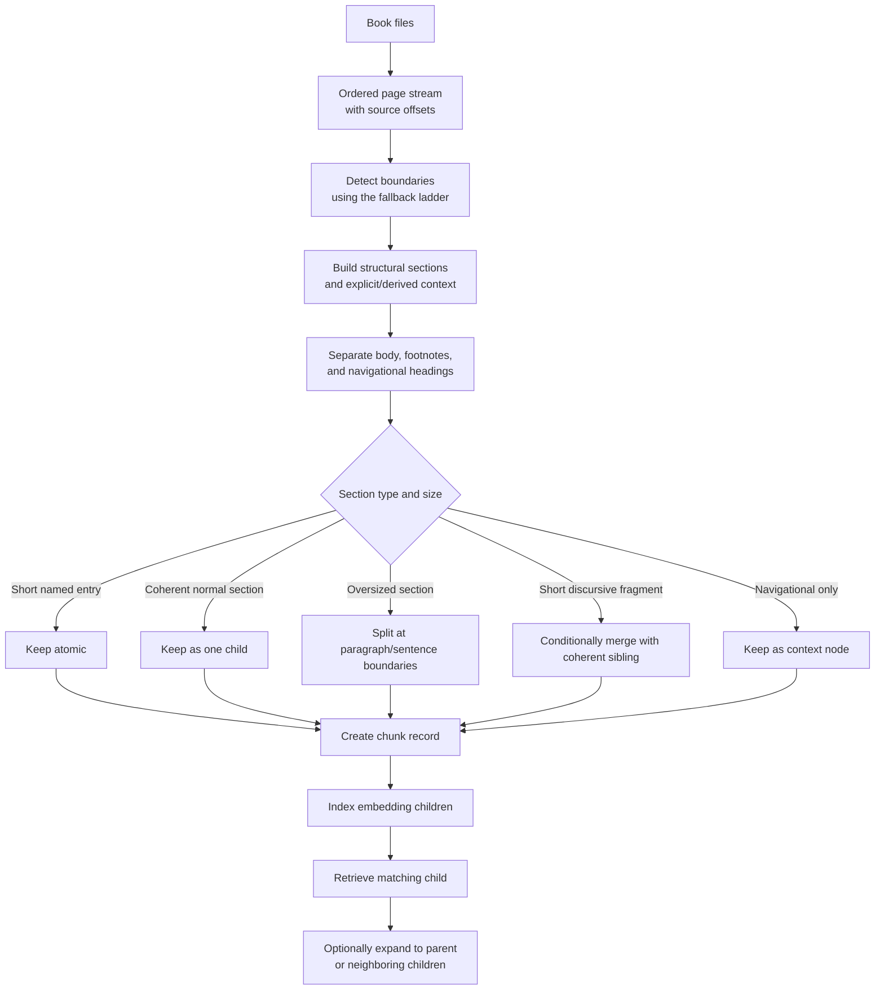

# General Module - Confirmed Chunking Mechanism

## Purpose

This document defines the proposed chunking mechanism for the general
question-answering module over the Shamela4 corpus.

It turns the original structure-first plan into an implementation-facing
specification. It keeps the original plan's correct ideas, incorporates the
review findings that were confirmed against the 10% corpus sample and full
metadata, and makes fallback behavior explicit.

This document covers chunk construction and the context returned after
retrieval. It does not select the final dense embedding model, sparse
retriever, or reranker.

## Status

- The overall mechanism is recommended for the initial implementation.
- The size thresholds in this document are starting values for evaluation,
  not permanent corpus constants.
- The mechanism must be validated on retrieval questions before indexing the
  complete corpus.
- The original source text must always be preserved unchanged.

## The Key Distinction

The implementation must distinguish three units:

| Unit | Meaning |
|---|---|
| Structural section | An author- or editor-defined container such as a `باب`, `فصل`, biographical entry, or dictionary entry |
| Embedding chunk | A bounded child text that receives one dense vector and is indexed for retrieval |
| Returned context | The matched child plus any parent or neighboring context selected for reranking or answer generation |

A structural section may produce:

- zero embedding chunks when it is only a navigational heading;
- one embedding chunk when it is coherent and appropriately sized;
- multiple embedding chunks when it is too large.

Therefore:

> The TOC section is the preferred structural parent. It is not necessarily
> one embedding vector.

## Why Structure Comes First

The questions handled by the general module are:

- semantic;
- spread across books and authors;
- sensitive to exact names, sects, titles, and attributed opinions.

Fixed page windows ignore author-defined boundaries. Pure fixed-token windows
can also join different biographies or divide one argument without preserving
its chapter context.

The chunker therefore uses the strongest available structural boundary first,
then applies token limits inside that structure.

## Input Files

Each book provides:

- `pages.jsonl`: ordered page body, footnotes, page identifiers, and inline
  title markup;
- `toc.jsonl`: hierarchical TOC entries and page anchors;
- `book_metadata.json`: book, author, category, edition, and bibliographic
  metadata;
- `manifest.json`: row counts and checksums.

The metadata tables under `_meta` provide optional page-level Quran, tafsir,
hadith, and isnad relationships.

## End-to-End Flow



## 1. Build the Ordered Source Stream

For each book:

1. Sort pages by `sequence_num`.
2. Preserve the original `body` and `footnotes` separately.
3. Preserve `page_id`, `shamela_page_id`, part, printed page number, and
   character offsets.
4. Never rely on printed `page_num` for ordering because it can restart across
   volumes.
5. Keep the exact original Arabic in `source_text`.

The chunker may create a normalized `retrieval_text`, but normalization must
not replace `source_text`.

## 2. Detect Boundaries Per Occurrence

Boundary selection is performed for each heading occurrence, not once per
book.

### Boundary Priority

| Priority | Boundary source | Treatment |
|---:|---|---|
| 1 | Inline `<span data-type="title" id=toc-N>` | Use as the primary exact sub-page boundary |
| 2 | Inline title span without an ID | Use as a structural boundary without claiming a TOC identity |
| 3 | TOC entry without an inline marker, but title text found on its page | Use the matched text offset and mark it as recovered |
| 4 | One unmatched TOC entry on a page with no stronger boundary | Use page start as a low-confidence fallback |
| 5 | Multiple unmatched TOC entries on the same page | Do not fabricate offsets; mark the page ambiguous and rely on paragraph/size safeguards |
| 6 | Book without usable TOC structure | Use paragraph and Arabic sentence boundaries |

Important implementation detail:

> `toc-N` maps to `toc.shamela_title_id`, not to the exported global
> `title_id`.

Every section should record a proposed `boundary_source`, such as:

- `inline_toc`;
- `inline_title`;
- `recovered_title`;
- `toc_page_fallback`;
- `paragraph_fallback`;
- `ambiguous_toc_page`.

It should also record a confidence level. This allows uncertain boundaries to
be inspected and improved without rebuilding the source extraction.

### Optional Heading Recovery

Some biography pages contain visible heading-like text that is absent from
both the TOC and title markup. Genre-specific patterns may help recover these
boundaries, but they must not be silently trusted.

For the initial implementation:

- record high-confidence candidates;
- split on them only after measuring boundary precision;
- retain paragraph and maximum-size guards even when a candidate is rejected.

## 3. Build Structural and Derived Context

Use `parent_id` to construct the explicit TOC path where that relationship is
available.

Do not assume every entry is attached to its apparent parent. For example, in
*أسد الغابة* the data explicitly links:

```text
حرف الباء الموحدة
└── باب الباء والألف
```

However, the following `باقوم` entry has `parent_id=null`. Its useful retrieval
trail can be derived from ordered headings:

```text
حرف الباء الموحدة > باب الباء والألف > باقوم
```

Record whether each path component came from:

- explicit `parent_id`; or
- the nearest active ordered navigational heading.

The second is context, not a claim that the source TOC encoded that parent
relationship.

Some parent headings are only navigational, such as:

- volume labels;
- alphabet ranges;
- `باب` headings with no body;
- indexes and section dividers.

A navigational heading should normally become a context node rather than an
independent searchable chunk.

## 4. Separate Content Roles

Body text and footnotes must not be concatenated into one undifferentiated
chunk.

Use at least:

- `content_role=body`;
- `content_role=footnote`.

Footnotes may contain:

- manuscript variants;
- editor explanations;
- citations;
- definitions;
- commentary not written by the original author.

Each footnote chunk should remain linked to its page and, where reliably
possible, its body chunk. When the marker relationship is uncertain, retain
only page-level linkage rather than inventing an exact attachment.

Footnote results may be retrieved, but downstream components must know that
they are notes and must not automatically attribute them to the book's
original author.

## 5. Apply the Size and Semantic Policy

The following values are proposed starting defaults:

| Structural unit | Initial treatment |
|---|---|
| Navigational heading with no substantive body | Keep only as parent context |
| Named/entity entry under approximately 128 tokens | Keep atomic |
| Discursive fragment under approximately 128 tokens | Merge only when the adjacent sibling has the same parent and content role and the result remains coherent |
| Coherent section from approximately 128 to 768 tokens | Keep as one embedding child |
| Section over approximately 768 tokens | Split into paragraph-aligned children targeting approximately 384-512 tokens |
| Forced split | Use approximately 64 tokens of overlap, confined to the same structural section |

These thresholds must be configuration values and must be tuned using the
retrieval evaluation set.


### Short Discursive Fragments

Merging is allowed only when all of the following are true:

- neither fragment represents a different named entity;
- both share the same structural parent;
- both have the same `content_role`;
- the merged text remains below the configured maximum;
- their source order is preserved.

The original child offsets must remain available after merging.

### Oversized Sections

Split using this priority:

1. explicit internal subheading;
2. paragraph boundary;
3. Arabic sentence boundary;
4. token boundary as the final fallback.

Do not allow an oversized child to cross into the next structural section.

Overlap is allowed only between consecutive children of the same oversized
section. It must not copy text between unrelated biographies or chapters.

## 6. Add Compact Retrieval Context

Each embedding child should receive a compact context prefix containing the
most useful available fields:

```text
الكتاب: <title>
المؤلف: <author>
المسار: <TOC parent > section heading>
نوع المحتوى: <body or footnote>
```

Do not prepend the full bibliographic `betaka_text`.

When the death year is the sentinel `99999`, treat it as unknown and omit it
from the text header. Preserve the normalized nullable value in metadata.

The header identifies source provenance. It does not prove who expressed
every proposition inside the passage. A book author may quote, reject, or
report another scholar's opinion.

The amount of context included in the dense input should be A/B tested because
repeated book metadata can also bias similarity. Structured fields must remain
available even when a shorter dense prefix performs better.


###

## ## Some Edge cases

### Example : An Unmarked Heading Inside a Marked Section

On page 519 of *أسد الغابة*, `toc-6342` starts the entry for Fāṭimah bint
al-Khaṭṭāb. Later the page contains an unmarked heading introducing Fāṭimah,
the daughter of the Prophet.

Correct treatment:

- record the explicit marker as high confidence;
- treat the visible unmarked biography heading as a recovery candidate;
- ensure paragraph and maximum-size safeguards prevent the combined text from
  becoming one oversized embedding child;
- retain boundary confidence for later inspection.

Why:

High overall anchor coverage does not mean every semantic boundary is marked.

### Example : A Book Without a TOC

*شرح حديث عمار بن ياسر رضي الله عنه* has 36 pages and zero TOC rows.

Correct treatment:

- use paragraphs and Arabic sentence boundaries;
- apply the same token limits;
- preserve page and book provenance;
- mark the boundary source as `paragraph_fallback`.

Why:

A TOC-only chunker would fail to index this book structurally.


## Clarification Required Before Retrieval Indexing

The chunking mechanism in this document does not depend on one embedding
model. However, the original plan contains an unresolved contradiction about
the sparse retrieval arm.

### Contradiction in the Original Plan

The original diagram proposes:

```text
Dense retrieval: BGE-M3 embeddings
Sparse retrieval: BM25 + root normalization
```

The prose later says that BGE-M3 produces both dense and sparse vectors and
therefore "is the hybrid stack."

These statements describe different systems:

- **BGE-M3 learned sparse** assigns neural, context-dependent weights to the
  subword tokens present in the text. It requires a BGE-M3 model pass.
- **BM25** is a classical lexical index based on term frequency, document
  frequency, and document length. It does not use BGE-M3 or any embedding
  model.

The original plan must therefore clarify which architecture it intends:

- [ ] BGE-M3 dense retrieval plus classical BM25.
- [ ] BGE-M3 dense retrieval plus BGE-M3 learned sparse retrieval.
- [ ] BGE-M3 dense retrieval plus both BGE-M3 learned sparse and classical
      BM25 as separate retrieval arms.

### Root Normalization Decision Required

The plan must explicitly decide whether root normalization will be:

- [ ] excluded from retrieval;
- [ ] applied to the primary BM25 field;
- [ ] indexed as a separate low-weight expansion field and evaluated against
      surface-only BM25.

**Proposal:** Keep the primary BM25 index on lightly normalized surface words
and exact phrases so proper names, sect names, and book titles remain precise.
Evaluate root expansion only as a separate low-weight, entity-aware field, and
enable it only if it improves labeled retrieval results.

### Evaluation Required Before Selecting Qwen or BGE-M3

Do not embed the full corpus before comparing:

- `Qwen/Qwen3-Embedding-8B`;
- `BAAI/bge-m3`.

The comparison should use the same chunk records produced by this document,
the same underlying Arabic questions, the same candidate limits, and the same
relevance judgments. Each model may use its officially recommended query
instruction or formatting, but that formatting must be recorded with the
evaluation results.

English user questions must follow the production path and be translated into
Arabic before retrieval. The evaluation set should contain both native Arabic
questions and Arabic translations of English questions.

Run the comparison in three stages:

1. **Dense-only comparison**
   - Qwen3-Embedding-8B dense retrieval.
   - BGE-M3 dense retrieval.
   - Keep reranking disabled so first-stage retrieval quality is isolated.

2. **Controlled hybrid comparison**
   - Qwen3-Embedding-8B dense plus the same Arabic surface BM25 index.
   - BGE-M3 dense plus the same Arabic surface BM25 index.
   - Use the same fusion method and candidate counts.

3. **BGE sparse ablation**
   - BGE-M3 dense plus BM25.
   - BGE-M3 dense plus BGE learned sparse.
   - BGE-M3 dense plus BGE learned sparse plus BM25.
   - This determines whether learned sparse retrieval adds enough recall to
     justify its additional sparse index.

The labeled questions should cover:

- exact scholar, narrator, sect, and book names;
- semantic paraphrases that do not share the same wording;
- Arabic morphological variants;
- short biographies and long discursive sections;
- multi-source disagreement questions;
- Quran and hadith references;
- native Arabic and translated-English queries.

Measure at least:

- `Recall@100` before reranking;
- `MRR@10` or `nDCG@10`;
- exact-entity retrieval accuracy;
- attribution and citation correctness;
- indexing throughput and query latency;
- vector and index storage;
- embedding and operational cost.

Keep the reranker fixed when it is introduced after the first-stage
comparison. Otherwise, reranker differences could hide which retriever
actually produced the better candidate set.

The model decision should be based on retrieval quality first, followed by the
operational tradeoff required to achieve that quality. Only the winning
configuration should be used to embed and index the full corpus.


## Validation Requirements

### Structural Validation

Verify that:

- every source character is preserved or explicitly classified as ignored
  markup;
- page order and source offsets are reproducible;
- every valid inline `toc-N` marker creates one structural boundary;
- `toc-N` maps to `shamela_title_id`;
- chunks never cross structural sections except an explicitly approved
  coherent short-fragment merge;
- named entries are not merged with different entities;
- overlap occurs only within the same oversized section;
- footnotes remain distinguishable from body text;
- missing and ambiguous boundaries are counted and reported.

### Retrieval Validation

Build a hand-labeled evaluation set

Measure at least:

- candidate recall before reranking;
- top-result relevance;
- exact-entity retrieval;
- attribution correctness;
- work and author diversity;
- chunk expansion quality;
- latency and index size.

Use the evaluation to tune:

- short-entry thresholds;
- normal-section maximum;
- child target size;
- overlap;
- context-header length;
- when neighbor expansion is useful;
- whether optional heading-recovery patterns are precise enough to enable.

##
## One-Sentence Decision

Use the book's TOC and inline title structure as the preferred semantic
container, resolve missing boundaries with an explicit per-occurrence fallback
ladder, keep short named entries atomic, split oversized sections into
paragraph-aligned children, separate footnotes from body text, and expand
retrieved children back to their parent context only when the query needs it.
